# ADM（架构开发方法）流程

**创建日期**: {{date}}  
**制定者**: {{author}}  
**版本**: {{version}}  
**状态**: {{status}}

## 概述

本文档描述了基于TOGAF ADM的架构开发方法流程，指导架构工作的执行。

## ADM阶段概览

```mermaid
graph LR
    A[预备阶段] --> B[阶段A:愿景]
    B --> C[阶段B:业务架构]
    C --> D[阶段C:信息系统架构]
    D --> E[阶段D:技术架构]
    E --> F[阶段E:机会与解决方案]
    F --> G[阶段F:迁移规划]
    G --> H[阶段G:实施治理]
    H --> I[阶段H:架构变更管理]
    I --> J[需求管理]
    
    style A fill:#4a90e2,color:#fff
    style B fill:#50c878,color:#fff
    style C fill:#ff6b6b,color:#fff
    style D fill:#ffa500,color:#fff
    style E fill:#9b59b6,color:#fff
```

## 各阶段详细说明

### 预备阶段

**目标**: {{preliminaryObjective}}

**关键活动**:
- {{activity1}}
- {{activity2}}
- {{activity3}}

**交付物**:
- {{deliverable1}}
- {{deliverable2}}

### 阶段A: 架构愿景

**目标**: {{phaseAObjective}}

**关键活动**:
- {{activity1}}
- {{activity2}}
- {{activity3}}

**交付物**:
- {{deliverable1}}
- {{deliverable2}}

### 阶段B: 业务架构

**目标**: {{phaseBObjective}}

**关键活动**:
- {{activity1}}
- {{activity2}}
- {{activity3}}

**交付物**:
- {{deliverable1}}
- {{deliverable2}}

### 阶段C: 信息系统架构

**目标**: {{phaseCObjective}}

**关键活动**:
- {{activity1}}
- {{activity2}}
- {{activity3}}

**交付物**:
- {{deliverable1}}
- {{deliverable2}}

### 阶段D: 技术架构

**目标**: {{phaseDObjective}}

**关键活动**:
- {{activity1}}
- {{activity2}}
- {{activity3}}

**交付物**:
- {{deliverable1}}
- {{deliverable2}}

### 阶段E: 机会与解决方案

**目标**: {{phaseEObjective}}

**关键活动**:
- {{activity1}}
- {{activity2}}
- {{activity3}}

**交付物**:
- {{deliverable1}}
- {{deliverable2}}

### 阶段F: 迁移规划

**目标**: {{phaseFObjective}}

**关键活动**:
- {{activity1}}
- {{activity2}}
- {{activity3}}

**交付物**:
- {{deliverable1}}
- {{deliverable2}}

### 阶段G: 实施治理

**目标**: {{phaseGObjective}}

**关键活动**:
- {{activity1}}
- {{activity2}}
- {{activity3}}

**交付物**:
- {{deliverable1}}
- {{deliverable2}}

### 阶段H: 架构变更管理

**目标**: {{phaseHObjective}}

**关键活动**:
- {{activity1}}
- {{activity2}}
- {{activity3}}

**交付物**:
- {{deliverable1}}
- {{deliverable2}}

### 需求管理

**目标**: {{requirementsManagementObjective}}

**关键活动**:
- {{activity1}}
- {{activity2}}
- {{activity3}}

## 流程检查点

| 检查点 | 阶段 | 检查内容 | 通过标准 |
|--------|------|---------|---------|
| CP-001 | 阶段A | {{checkpoint1}} | {{criteria1}} |
| CP-002 | 阶段B | {{checkpoint2}} | {{criteria2}} |
| CP-003 | 阶段C | {{checkpoint3}} | {{criteria3}} |

## 相关文档

- [[架构评审流程]]
- [[架构委员会]]
- [[角色与职责]]

## 变更记录

| 日期 | 版本 | 变更内容 | 变更人 |
|------|------|----------|--------|
| {{date}} | 1.0 | 初始版本 | {{author}} |

