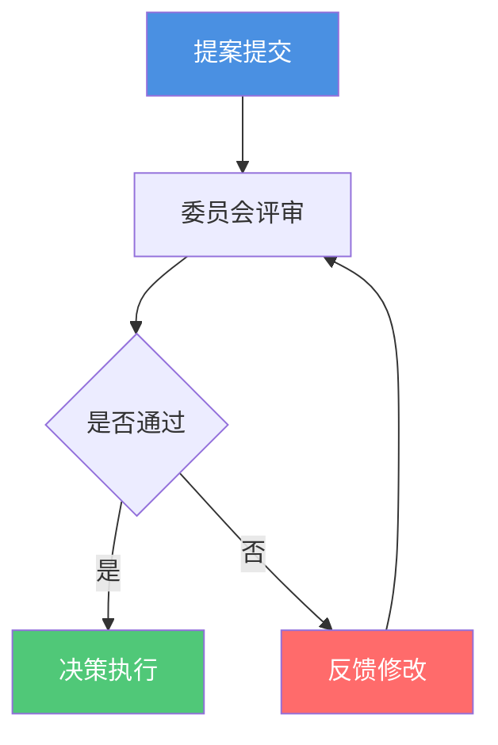

# 架构委员会章程

**创建日期**: {{date}}  
**制定者**: {{author}}  
**版本**: {{version}}  
**状态**: {{status}}

## 概述

本文档定义了架构委员会的职责、组成、运作方式和决策流程。

## 委员会定位

### 使命

{{mission}}

### 愿景

{{vision}}

## 委员会组成

### 成员结构

| 角色 | 职责 | 成员 | 任期 |
|------|------|------|------|
| 主席 | {{chairmanRole}} | {{chairmanName}} | {{chairmanTerm}} |
| 首席架构师 | {{chiefArchitectRole}} | {{chiefArchitectName}} | {{chiefArchitectTerm}} |
| 业务代表 | {{businessRepresentativeRole}} | {{businessRepresentativeName}} | {{businessRepresentativeTerm}} |
| 技术代表 | {{technicalRepresentativeRole}} | {{technicalRepresentativeName}} | {{technicalRepresentativeTerm}} |

### 成员资格要求

{{membershipRequirements}}

## 职责范围

### 核心职责

1. **{{responsibility1}}**: {{description1}}
2. **{{responsibility2}}**: {{description2}}
3. **{{responsibility3}}**: {{description3}}

### 决策权限

{{decisionAuthority}}

## 运作方式

### 会议频率

{{meetingFrequency}}

### 会议议程

{{meetingAgenda}}

### 决策流程

## 决策记录

| 决策ID | 决策主题 | 决策日期 | 决策结果 | 负责人 |
|--------|---------|---------|---------|--------|
| DEC-001 | {{decision1}} | {{date1}} | {{result1}} | {{owner1}} |
| DEC-002 | {{decision2}} | {{date2}} | {{result2}} | {{owner2}} |

## 相关文档

- [[角色与职责]]
- [[架构评审流程]]
- [[架构决策记录]]

## 变更记录

| 日期 | 版本 | 变更内容 | 变更人 |
|------|------|----------|--------|
| {{date}} | 1.0 | 初始版本 | {{author}} |

