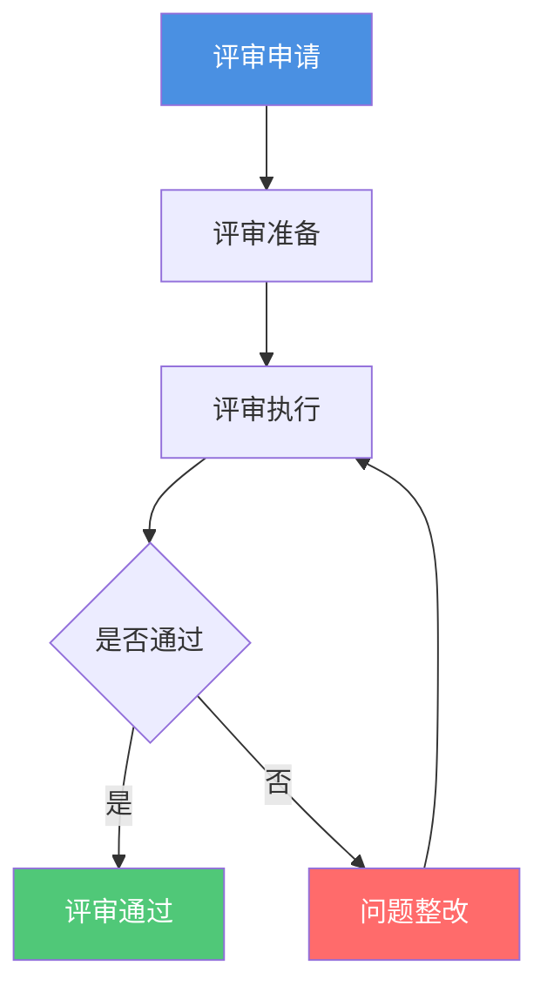

# 架构评审流程

**创建日期**: {{date}}  
**制定者**: {{author}}  
**版本**: {{version}}  
**状态**: {{status}}

## 概述

本文档定义了架构评审的流程、标准和检查清单。

## 评审类型

### 评审类型列表

| 评审类型 | 触发条件 | 评审频率 | 评审人 |
|---------|---------|---------|--------|
| {{reviewType1}} | {{trigger1}} | {{frequency1}} | {{reviewer1}} |
| {{reviewType2}} | {{trigger2}} | {{frequency2}} | {{reviewer2}} |

## 评审流程

## 评审标准

{{reviewStandards}}

## 评审检查清单

{{reviewChecklist}}

## 评审记录

| 评审ID | 评审对象 | 评审日期 | 评审结果 | 评审人 |
|--------|---------|---------|---------|--------|
| REV-001 | {{reviewTarget1}} | {{date1}} | {{result1}} | {{reviewer1}} |

## 相关文档

- [[ADM流程]]
- [[架构委员会]]

## 变更记录

| 日期 | 版本 | 变更内容 | 变更人 |
|------|------|----------|--------|
| {{date}} | 1.0 | 初始版本 | {{author}} |

