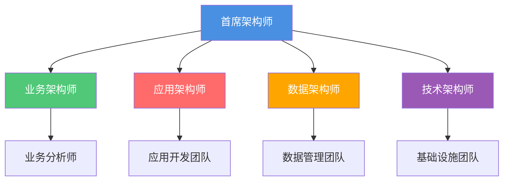

# 架构角色与职责

**创建日期**: {{date}}  
**制定者**: {{author}}  
**版本**: {{version}}  
**状态**: {{status}}

## 概述

本文档定义了企业架构中的各种角色及其职责，确保架构工作的有效执行。

## 角色矩阵

| 角色 | 主要职责 | 技能要求 | 汇报关系 |
|------|---------|---------|---------|
| 首席架构师 | {{chiefArchitectDuties}} | {{chiefArchitectSkills}} | {{chiefArchitectReporting}} |
| 业务架构师 | {{businessArchitectDuties}} | {{businessArchitectSkills}} | {{businessArchitectReporting}} |
| 应用架构师 | {{applicationArchitectDuties}} | {{applicationArchitectSkills}} | {{applicationArchitectReporting}} |
| 数据架构师 | {{dataArchitectDuties}} | {{dataArchitectSkills}} | {{dataArchitectReporting}} |
| 技术架构师 | {{technologyArchitectDuties}} | {{technologyArchitectSkills}} | {{technologyArchitectReporting}} |

## 角色详细说明

### 首席架构师

**职责**:
- {{duty1}}
- {{duty2}}
- {{duty3}}

**技能要求**:
- {{skill1}}
- {{skill2}}
- {{skill3}}

**关键成果**:
- {{deliverable1}}
- {{deliverable2}}

### 业务架构师

**职责**:
- {{duty1}}
- {{duty2}}
- {{duty3}}

**技能要求**:
- {{skill1}}
- {{skill2}}
- {{skill3}}

**关键成果**:
- {{deliverable1}}
- {{deliverable2}}

### 应用架构师

**职责**:
- {{duty1}}
- {{duty2}}
- {{duty3}}

**技能要求**:
- {{skill1}}
- {{skill2}}
- {{skill3}}

**关键成果**:
- {{deliverable1}}
- {{deliverable2}}

### 数据架构师

**职责**:
- {{duty1}}
- {{duty2}}
- {{duty3}}

**技能要求**:
- {{skill1}}
- {{skill2}}
- {{skill3}}

**关键成果**:
- {{deliverable1}}
- {{deliverable2}}

### 技术架构师

**职责**:
- {{duty1}}
- {{duty2}}
- {{duty3}}

**技能要求**:
- {{skill1}}
- {{skill2}}
- {{skill3}}

**关键成果**:
- {{deliverable1}}
- {{deliverable2}}

## 角色关系图

## 协作模式

{{collaborationModel}}

## 相关文档

- [[架构委员会]]
- [[架构流程]]
- [[技能矩阵]]

## 变更记录

| 日期 | 版本 | 变更内容 | 变更人 |
|------|------|----------|--------|
| {{date}} | 1.0 | 初始版本 | {{author}} |

