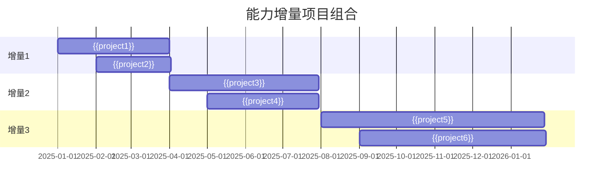

# {{capabilityName}} 能力增量

**创建日期**: {{date}}  
**架构师**: {{architect}}  
**版本**: {{version}}  
**状态**: {{status}}

## 概述

本文档描述了 {{capabilityName}} 的能力增量计划，包括从当前能力到目标能力的增量路径、工作包分组和项目组合管理。

## 能力增量概览

### 增量路径


### 增量阶段

| 增量阶段 | 阶段名称 | 目标能力 | 预计时间 | 关键成果 |
|---------|---------|---------|---------|---------|
| 增量1 | {{increment1Name}} | {{increment1Target}} | {{increment1Duration}} | {{increment1Outcome}} |
| 增量2 | {{increment2Name}} | {{increment2Target}} | {{increment2Duration}} | {{increment2Outcome}} |
| 增量3 | {{increment3Name}} | {{increment3Target}} | {{increment3Duration}} | {{increment3Outcome}} |

## 增量1：{{increment1Name}}

### 增量描述

{{increment1Description}}

### 能力提升

{{increment1CapabilityImprovement}}

### 工作包

| 工作包ID | 工作包名称 | 描述 | 优先级 | 状态 |
|---------|-----------|------|--------|------|
| {{workPackage1}} | {{wp1Name}} | {{wp1Description}} | {{wp1Priority}} | {{wp1Status}} |
| {{workPackage2}} | {{wp2Name}} | {{wp2Description}} | {{wp2Priority}} | {{wp2Status}} |

### 关联项目

| 项目名称 | 项目状态 | 对增量的贡献 | 开始时间 | 结束时间 |
|---------|---------|------------|---------|---------|
| {{project1}} | {{status1}} | {{contribution1}} | {{start1}} | {{end1}} |
| {{project2}} | {{status2}} | {{contribution2}} | {{start2}} | {{end2}} |

## 增量2：{{increment2Name}}

### 增量描述

{{increment2Description}}

### 能力提升

{{increment2CapabilityImprovement}}

### 工作包

| 工作包ID | 工作包名称 | 描述 | 优先级 | 状态 |
|---------|-----------|------|--------|------|
| {{workPackage3}} | {{wp3Name}} | {{wp3Description}} | {{wp3Priority}} | {{wp3Status}} |
| {{workPackage4}} | {{wp4Name}} | {{wp4Description}} | {{wp4Priority}} | {{wp4Status}} |

### 关联项目

| 项目名称 | 项目状态 | 对增量的贡献 | 开始时间 | 结束时间 |
|---------|---------|------------|---------|---------|
| {{project3}} | {{status3}} | {{contribution3}} | {{start3}} | {{end3}} |
| {{project4}} | {{status4}} | {{contribution4}} | {{start4}} | {{end4}} |

## 增量3：{{increment3Name}}

### 增量描述

{{increment3Description}}

### 能力提升

{{increment3CapabilityImprovement}}

### 工作包

| 工作包ID | 工作包名称 | 描述 | 优先级 | 状态 |
|---------|-----------|------|--------|------|
| {{workPackage5}} | {{wp5Name}} | {{wp5Description}} | {{wp5Priority}} | {{wp5Status}} |
| {{workPackage6}} | {{wp6Name}} | {{wp6Description}} | {{wp6Priority}} | {{wp6Status}} |

### 关联项目

| 项目名称 | 项目状态 | 对增量的贡献 | 开始时间 | 结束时间 |
|---------|---------|------------|---------|---------|
| {{project5}} | {{status5}} | {{contribution5}} | {{start5}} | {{end5}} |
| {{project6}} | {{status6}} | {{contribution6}} | {{start6}} | {{end6}} |

## 项目组合管理

### 项目组合视图



### 项目依赖关系

```mermaid
graph TB
    A[增量1项目] --> B[增量2项目]
    B --> C[增量3项目]
    
    A1[{{project1}}] --> A
    A2[{{project2}}] --> A
    B1[{{project3}}] --> B
    B2[{{project4}}] --> B
    C1[{{project5}}] --> C
    C2[{{project6}}] --> C
    
    style A fill:#ff6b6b,color:#fff
    style B fill:#ffa500,color:#fff
    style C fill:#50c878,color:#fff
```

## 能力演进路径

### 能力成熟度演进

| 阶段 | 业务成熟度 | 应用成熟度 | 数据成熟度 | 技术成熟度 | 综合成熟度 |
|------|-----------|-----------|-----------|-----------|-----------|
| 当前 | {{currentBusiness}} | {{currentApplication}} | {{currentData}} | {{currentTechnology}} | {{currentOverall}} |
| 增量1后 | {{afterIncrement1Business}} | {{afterIncrement1Application}} | {{afterIncrement1Data}} | {{afterIncrement1Technology}} | {{afterIncrement1Overall}} |
| 增量2后 | {{afterIncrement2Business}} | {{afterIncrement2Application}} | {{afterIncrement2Data}} | {{afterIncrement2Technology}} | {{afterIncrement2Overall}} |
| 增量3后 | {{afterIncrement3Business}} | {{afterIncrement3Application}} | {{afterIncrement3Data}} | {{afterIncrement3Technology}} | {{afterIncrement3Overall}} |
| 目标 | {{targetBusiness}} | {{targetApplication}} | {{targetData}} | {{targetTechnology}} | {{targetOverall}} |

## 风险和约束

### 主要风险

{{keyRisks}}

### 约束条件

{{constraints}}

## 相关文档

- [[当前能力]]
- [[目标能力]]
- [[相关领域架构]]

## 变更记录

| 日期 | 版本 | 变更内容 | 变更人 |
|------|------|----------|--------|
| {{date}} | 1.0 | 初始版本 | {{architect}} |

