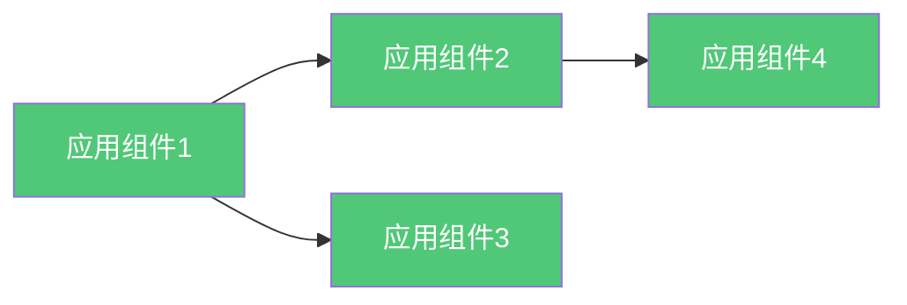
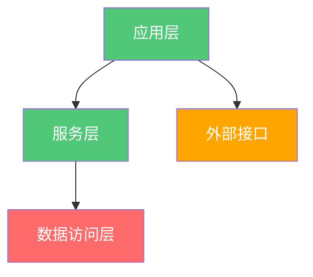

# {{domainName}} 应用架构

**创建日期**: {{date}}  
**架构师**: {{architect}}  
**版本**: {{version}}  
**状态**: {{status}}  
**架构状态**: {{architectureState}} (Baseline/Target/Transition)

## 概述

本文档描述了 {{domainName}} 的{{architectureState}}应用架构，包括应用组件、应用服务、接口定义和应用交互。

## 应用组件

### 组件目录

| 组件ID | 组件名称 | 组件描述 | 技术栈 | 状态 |
|--------|---------|---------|--------|------|
| APP-001 | {{component1}} | {{description1}} | {{techStack1}} | {{status1}} |
| APP-002 | {{component2}} | {{description2}} | {{techStack2}} | {{status2}} |

### 组件关系

## 应用服务

### 服务目录

| 服务ID | 服务名称 | 服务描述 | 服务类型 | 接口 |
|--------|---------|---------|---------|------|
| SVC-001 | {{service1}} | {{description1}} | {{type1}} | {{interface1}} |
| SVC-002 | {{service2}} | {{description2}} | {{type2}} | {{interface2}} |

## 接口定义

### 接口目录

| 接口ID | 接口名称 | 接口类型 | 协议 | 描述 |
|--------|---------|---------|------|------|
| INT-001 | {{interface1}} | {{type1}} | {{protocol1}} | {{description1}} |
| INT-002 | {{interface2}} | {{type2}} | {{protocol2}} | {{description2}} |

## 应用交互

### 通信模式

{{communicationPatterns}}

### 依赖关系

{{dependencies}}

## 架构图

## 相关文档

- [[业务架构]]
- [[数据架构]]
- [[技术架构]]

## 变更记录

| 日期 | 版本 | 变更内容 | 变更人 |
|------|------|----------|--------|
| {{date}} | 1.0 | 初始版本 | {{architect}} |

