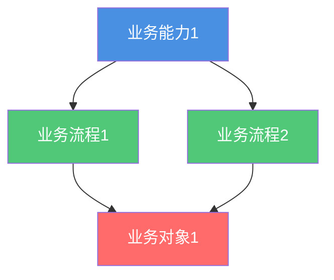

# {{domainName}} 业务架构

**创建日期**: {{date}}  
**架构师**: {{architect}}  
**版本**: {{version}}  
**状态**: {{status}}  
**架构状态**: {{architectureState}} (Baseline/Target/Transition)

## 概述

本文档描述了 {{domainName}} 的{{architectureState}}业务架构，包括业务能力、价值流、业务流程和组织架构。

## 业务能力

### 能力地图

{{capabilityMap}}

### 关键能力

| 能力ID | 能力名称 | 能力描述 | 成熟度 | 业务价值 |
|--------|---------|---------|--------|---------|
| CAP-001 | {{capability1}} | {{description1}} | {{maturity1}} | {{value1}} |
| CAP-002 | {{capability2}} | {{description2}} | {{maturity2}} | {{value2}} |

## 价值流

### 价值流图

{{valueStream}}

### 关键价值流

- **{{valueStream1}}**: {{description1}}
- **{{valueStream2}}**: {{description2}}

## 业务流程

### 高层业务流程

{{highLevelProcess}}

### 关键流程

- **{{process1}}**: {{description1}}
- **{{process2}}**: {{description2}}

## 组织架构

### 角色与职责

{{rolesAndResponsibilities}}

### 组织单元

{{organizationalUnits}}

## 业务对象

### 业务术语表

{{businessGlossary}}

## 架构图

## 相关文档

- [[应用架构]]
- [[数据架构]]
- [[技术架构]]

## 变更记录

| 日期 | 版本 | 变更内容 | 变更人 |
|------|------|----------|--------|
| {{date}} | 1.0 | 初始版本 | {{architect}} |

