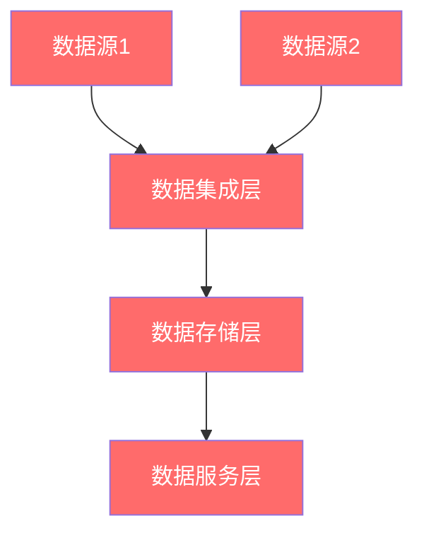

# {{domainName}} 数据架构

**创建日期**: {{date}}  
**架构师**: {{architect}}  
**版本**: {{version}}  
**状态**: {{status}}  
**架构状态**: {{architectureState}} (Baseline/Target/Transition)

## 概述

本文档描述了 {{domainName}} 的{{architectureState}}数据架构，包括数据域、数据模型、数据流和数据治理。

## 数据域

### 数据域划分

{{dataDomainDivision}}

### 关键数据域

| 数据域ID | 数据域名称 | 数据域描述 | 数据所有者 |
|---------|-----------|-----------|-----------|
| DOM-001 | {{domain1}} | {{description1}} | {{owner1}} |
| DOM-002 | {{domain2}} | {{description2}} | {{owner2}} |

## 数据模型

### 逻辑数据模型

{{logicalDataModel}}

### 关键实体

| 实体ID | 实体名称 | 实体描述 | 关键属性 |
|--------|---------|---------|---------|
| ENT-001 | {{entity1}} | {{description1}} | {{attributes1}} |
| ENT-002 | {{entity2}} | {{description2}} | {{attributes2}} |

## 数据流

### 数据流图

{{dataFlowDiagram}}

### 关键数据流

- **{{dataFlow1}}**: {{description1}}
- **{{dataFlow2}}**: {{description2}}

## 数据治理

### 数据分类

{{dataClassification}}

### 数据质量

{{dataQuality}}

## 架构图

## 相关文档

- [[业务架构]]
- [[应用架构]]
- [[技术架构]]

## 变更记录

| 日期 | 版本 | 变更内容 | 变更人 |
|------|------|----------|--------|
| {{date}} | 1.0 | 初始版本 | {{architect}} |

