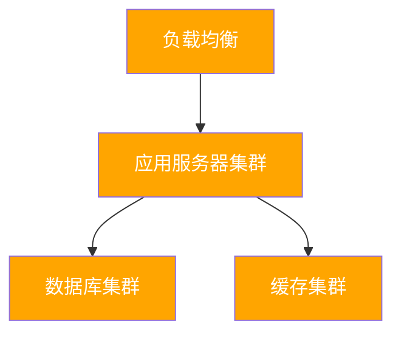

# {{domainName}} 技术架构

**创建日期**: {{date}}  
**架构师**: {{architect}}  
**版本**: {{version}}  
**状态**: {{status}}  
**架构状态**: {{architectureState}} (Baseline/Target/Transition)

## 概述

本文档描述了 {{domainName}} 的{{architectureState}}技术架构，包括技术平台、基础设施、安全架构和部署架构。

## 技术平台

### 技术栈

| 技术类别 | 技术选型 | 版本 | 说明 |
|---------|---------|------|------|
| 运行时平台 | {{runtimePlatform}} | {{version1}} | {{description1}} |
| 中间件 | {{middleware}} | {{version2}} | {{description2}} |
| 数据库 | {{database}} | {{version3}} | {{description3}} |

### 技术构建块

{{technologyBuildingBlocks}}

## 基础设施

### 基础设施视图

{{infrastructureView}}

### 部署架构

## 安全架构

### 安全控制

{{securityControls}}

### 身份与访问管理

{{identityAndAccessManagement}}

## 网络架构

### 网络拓扑

{{networkTopology}}

## 相关文档

- [[业务架构]]
- [[应用架构]]
- [[数据架构]]

## 变更记录

| 日期 | 版本 | 变更内容 | 变更人 |
|------|------|----------|--------|
| {{date}} | 1.0 | 初始版本 | {{architect}} |

