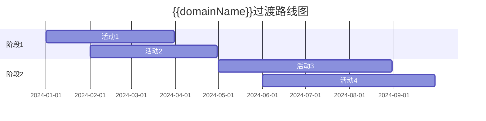

# {{domainName}} 过渡计划

**创建日期**: {{date}}  
**架构师**: {{architect}}  
**版本**: {{version}}  
**状态**: {{status}}

## 概述

本文档描述了 {{domainName}} 从基线架构到目标架构的过渡计划。

## 过渡目标

{{transitionObjective}}

## 过渡阶段

### 阶段1: {{phase1Name}}

**目标**: {{phase1Objective}}

**时间范围**: {{phase1TimeRange}}

**关键活动**:
- {{activity1}}
- {{activity2}}
- {{activity3}}

**交付物**:
- {{deliverable1}}
- {{deliverable2}}

### 阶段2: {{phase2Name}}

**目标**: {{phase2Objective}}

**时间范围**: {{phase2TimeRange}}

**关键活动**:
- {{activity1}}
- {{activity2}}
- {{activity3}}

**交付物**:
- {{deliverable1}}
- {{deliverable2}}

## 过渡路线图

## 风险与缓解

### 主要风险

| 风险 | 影响 | 概率 | 缓解措施 |
|------|------|------|---------|
| {{risk1}} | {{impact1}} | {{probability1}} | {{mitigation1}} |
| {{risk2}} | {{impact2}} | {{probability2}} | {{mitigation2}} |

## 相关文档

- [[基线架构]]
- [[目标架构]]
- [[业务架构]]
- [[应用架构]]

## 变更记录

| 日期 | 版本 | 变更内容 | 变更人 |
|------|------|----------|--------|
| {{date}} | 1.0 | 初始版本 | {{architect}} |

