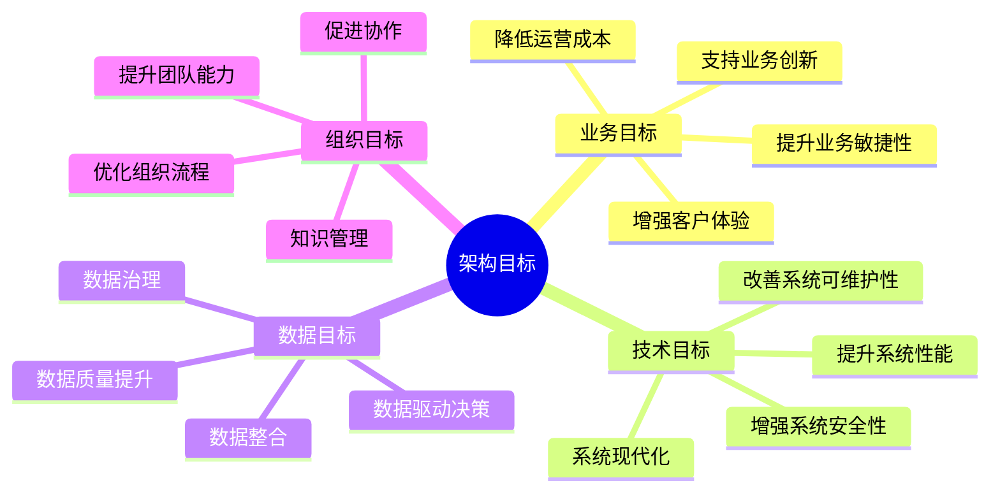
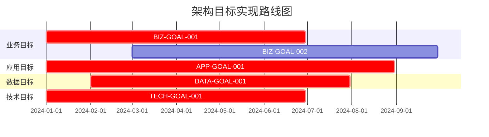

# {{systemName}} 架构目标

**创建日期**: {{date}}  
**架构师**: {{architect}}  
**版本**: {{version}}  
**状态**: {{status}}

## 概述

本文档定义了 {{systemName}} 的架构目标，这些目标支撑架构愿景的实现，为架构设计和实施提供明确的指导方向。架构目标遵循 SMART 原则（具体、可衡量、可达成、相关性、时限性）。

## 目标分类

架构目标按照以下维度进行分类：

## 业务架构目标

### 目标列表

| 目标ID | 目标描述 | 优先级 | 目标日期 | 负责人 | 成功标准 |
|--------|---------|--------|---------|--------|---------|
| BIZ-GOAL-001 | {{businessGoal1}} | 高 | {{targetDate1}} | {{owner1}} | {{successCriteria1}} |
| BIZ-GOAL-002 | {{businessGoal2}} | 高 | {{targetDate2}} | {{owner2}} | {{successCriteria2}} |
| BIZ-GOAL-003 | {{businessGoal3}} | 中 | {{targetDate3}} | {{owner3}} | {{successCriteria3}} |

## 应用架构目标

### 目标列表

| 目标ID | 目标描述 | 优先级 | 目标日期 | 负责人 | 成功标准 |
|--------|---------|--------|---------|--------|---------|
| APP-GOAL-001 | {{applicationGoal1}} | 高 | {{targetDate1}} | {{owner1}} | {{successCriteria1}} |
| APP-GOAL-002 | {{applicationGoal2}} | 高 | {{targetDate2}} | {{owner2}} | {{successCriteria2}} |

## 数据架构目标

### 目标列表

| 目标ID | 目标描述 | 优先级 | 目标日期 | 负责人 | 成功标准 |
|--------|---------|--------|---------|--------|---------|
| DATA-GOAL-001 | {{dataGoal1}} | 高 | {{targetDate1}} | {{owner1}} | {{successCriteria1}} |
| DATA-GOAL-002 | {{dataGoal2}} | 高 | {{targetDate2}} | {{owner2}} | {{successCriteria2}} |

## 技术架构目标

### 目标列表

| 目标ID | 目标描述 | 优先级 | 目标日期 | 负责人 | 成功标准 |
|--------|---------|--------|---------|--------|---------|
| TECH-GOAL-001 | {{technologyGoal1}} | 高 | {{targetDate1}} | {{owner1}} | {{successCriteria1}} |
| TECH-GOAL-002 | {{technologyGoal2}} | 高 | {{targetDate2}} | {{owner2}} | {{successCriteria2}} |

## 目标实现路线图

## 相关文档

- [[架构愿景声明]]
- [[利益相关者分析]]
- [[范围与约束]]

## 变更记录

| 日期 | 版本 | 变更内容 | 变更人 | 审批人 |
|------|------|----------|--------|--------|
| {{date}} | 1.0 | 初始版本 | {{architect}} | {{approver}} |

