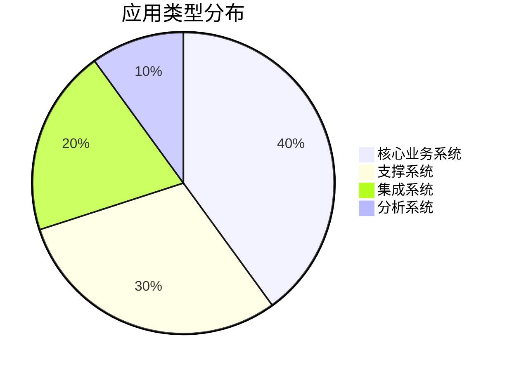
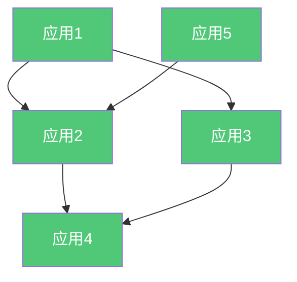

# 企业级应用架构

**创建日期**: {{date}}  
**架构师**: {{architect}}  
**版本**: {{version}}  
**状态**: {{status}}

## 概述

本文档描述了企业级的应用架构，提供跨领域的应用视图，包括应用组合、应用服务、应用接口和应用景观。

## 应用组合

### 应用组合概览

{{applicationPortfolioOverview}}

### 应用分类

| 应用ID | 应用名称 | 应用类型 | 所属域 | 状态 | 关键功能 |
|--------|---------|---------|--------|------|---------|
| APP-001 | {{application1}} | {{type1}} | {{domain1}} | {{status1}} | {{function1}} |
| APP-002 | {{application2}} | {{type2}} | {{domain2}} | {{status2}} | {{function2}} |

### 应用分类统计

## 应用服务目录

### 企业级服务概览

{{enterpriseServicesOverview}}

### 服务分类

| 服务ID | 服务名称 | 服务类型 | 提供方 | 消费者 |
|--------|---------|---------|--------|--------|
| SVC-001 | {{service1}} | {{type1}} | {{provider1}} | {{consumer1}} |
| SVC-002 | {{service2}} | {{type2}} | {{provider2}} | {{consumer2}} |

## 应用接口目录

### 接口概览

{{interfacesOverview}}

### 接口分类

| 接口ID | 接口名称 | 接口类型 | 协议 | 提供方 |
|--------|---------|---------|------|--------|
| INT-001 | {{interface1}} | {{type1}} | {{protocol1}} | {{provider1}} |
| INT-002 | {{interface2}} | {{type2}} | {{protocol2}} | {{provider2}} |

## 应用景观图

### 应用依赖关系

### 应用交互模式

{{applicationInteractionPatterns}}

## 应用生命周期

### 应用状态分布

{{applicationLifecycleStatus}}

## 相关文档

- [[企业业务架构]]
- [[企业数据架构]]
- [[企业技术架构]]
- [[领域架构]]

## 变更记录

| 日期     | 版本 | 变更内容 | 变更人     |
| -------- | ---- | -------- | ---------- |
| {{date}} | 1.0  | 初始版本 | {{architect}} |

