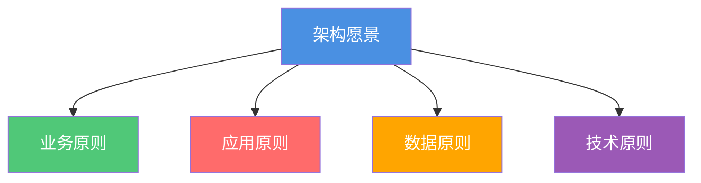

# 原则对齐分析

**创建日期**: {{date}}  
**架构师**: {{architect}}  
**版本**: {{version}}  
**状态**: {{status}}

## 概述

本文档分析了架构愿景与架构原则的对齐情况，确保架构设计符合既定原则。

## 原则对齐矩阵

| 架构原则 | 架构愿景要素 | 对齐度 | 说明 |
|---------|------------|--------|------|
| {{principle1}} | {{visionElement1}} | {{alignment1}} | {{explanation1}} |
| {{principle2}} | {{visionElement2}} | {{alignment2}} | {{explanation2}} |
| {{principle3}} | {{visionElement3}} | {{alignment3}} | {{explanation3}} |

## 对齐分析

### 高度对齐的原则

{{highAlignmentPrinciples}}

### 需要改进的对齐

{{improvementAreas}}

## 对齐关系图

## 改进建议

{{improvementRecommendations}}

## 相关文档

- [[架构愿景声明]]
- [[架构原则]]

## 变更记录

| 日期 | 版本 | 变更内容 | 变更人 |
|------|------|----------|--------|
| {{date}} | 1.0 | 初始版本 | {{architect}} |

