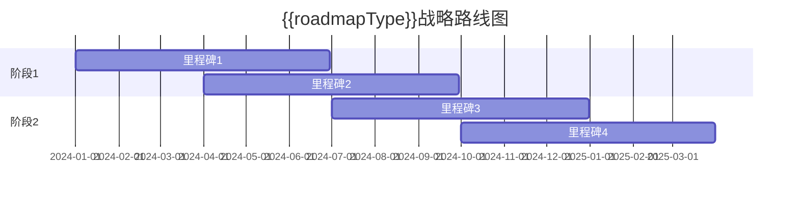

# {{systemName}} 战略路线图

**创建日期**: {{date}}  
**架构师**: {{architect}}  
**版本**: {{version}}  
**状态**: {{status}}

## 概述

本文档描述了 {{systemName}} 的{{roadmapType}}战略路线图，展示了从当前状态到目标状态的演进路径。

## 路线图概览

## 关键里程碑

| 里程碑 | 目标日期 | 关键成果 | 负责人 |
|--------|---------|---------|--------|
| {{milestone1}} | {{date1}} | {{outcome1}} | {{owner1}} |
| {{milestone2}} | {{date2}} | {{outcome2}} | {{owner2}} |

## 阶段规划

### 阶段1: {{phase1Name}}

**目标**: {{phase1Objective}}

**关键活动**:
- {{activity1}}
- {{activity2}}

**交付物**:
- {{deliverable1}}
- {{deliverable2}}

### 阶段2: {{phase2Name}}

**目标**: {{phase2Objective}}

**关键活动**:
- {{activity1}}
- {{activity2}}

**交付物**:
- {{deliverable1}}
- {{deliverable2}}

## 风险与依赖

### 主要风险

{{majorRisks}}

### 关键依赖

{{keyDependencies}}

## 相关文档

- [[架构愿景声明]]
- [[架构目标]]
- [[转型地图]]

## 变更记录

| 日期 | 版本 | 变更内容 | 变更人 |
|------|------|----------|--------|
| {{date}} | 1.0 | 初始版本 | {{architect}} |

