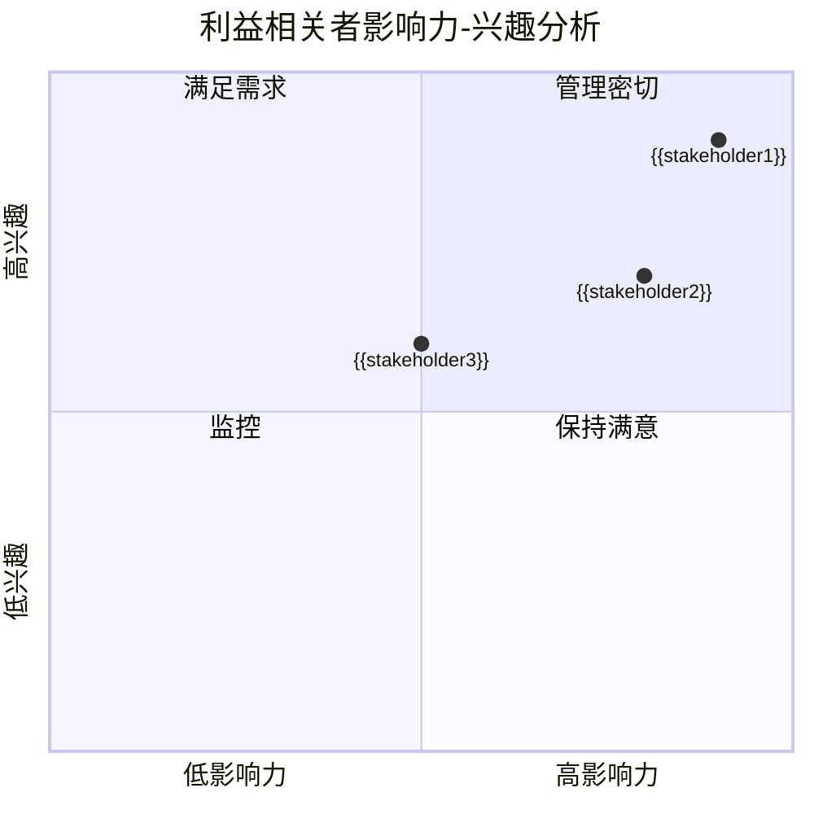

# {{systemName}} 利益相关者分析

**创建日期**: {{date}}  
**分析者**: {{analyst}}  
**版本**: {{version}}  
**状态**: {{status}}

## 概述

本文档识别和分析与 {{systemName}} 架构相关的所有利益相关者，包括他们的角色、关注点、影响力、参与程度和沟通策略。

## 利益相关者矩阵

| 利益相关者 | 角色 | 影响力 | 兴趣度 | 关注点 | 沟通方式 | 参与度 |
|-----------|------|--------|--------|--------|---------|--------|
| {{stakeholder1}} | {{role1}} | {{influence1}} | {{interest1}} | {{concern1}} | {{communication1}} | {{engagement1}} |
| {{stakeholder2}} | {{role2}} | {{influence2}} | {{interest2}} | {{concern2}} | {{communication2}} | {{engagement2}} |
| {{stakeholder3}} | {{role3}} | {{influence3}} | {{interest3}} | {{concern3}} | {{communication3}} | {{engagement3}} |

## 影响力-兴趣分析

## 利益相关者关注点

### 业务关注点

- **{{businessConcern1}}**: {{concern1Description}}
- **{{businessConcern2}}**: {{concern2Description}}

### 技术关注点

- **{{technicalConcern1}}**: {{concern1Description}}
- **{{technicalConcern2}}**: {{concern2Description}}

## 沟通计划

### 定期沟通

- **周报**: {{weeklyReportAudience}}
- **月报**: {{monthlyReportAudience}}
- **季度评审**: {{quarterlyReviewAudience}}

## 相关文档

- [[架构愿景声明]]
- [[架构目标]]
- [[范围与约束]]

## 变更记录

| 日期 | 版本 | 变更内容 | 变更人 | 审批人 |
|------|------|----------|--------|--------|
| {{date}} | 1.0 | 初始版本 | {{analyst}} | {{approver}} |

