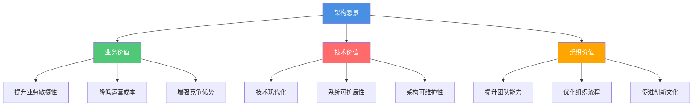
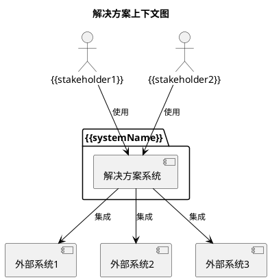

# {{systemName}} 架构愿景声明

**创建日期**: {{date}}  
**架构师**: {{architect}}  
**版本**: {{version}}  
**状态**: {{status}}

## 执行摘要

{{executiveSummary}}

本文档阐述了 {{systemName}} 的架构愿景，定义了架构转型的目标状态，为后续的架构设计和实施提供方向指引。

## 业务背景

### 当前状态

{{currentState}}

**当前挑战**:
- {{challenge1}}
- {{challenge2}}
- {{challenge3}}

### 业务驱动因素

{{businessDrivers}}

**关键驱动因素**:
1. **{{driver1}}**: {{driver1Description}}
2. **{{driver2}}**: {{driver2Description}}
3. **{{driver3}}**: {{driver3Description}}

### 业务目标

{{businessObjectives}}

## 架构愿景

### 愿景描述

{{visionDescription}}

### 愿景目标

我们的架构愿景是构建一个{{visionGoal}}，实现以下目标：

1. **{{goal1}}**: {{goal1Description}}
2. **{{goal2}}**: {{goal2Description}}
3. **{{goal3}}**: {{goal3Description}}
4. **{{goal4}}**: {{goal4Description}}

### 愿景价值主张

## 目标架构状态

### 架构特征

目标架构应具备以下特征：

| 特征 | 描述 | 优先级 |
|------|------|--------|
| **{{characteristic1}}** | {{characteristic1Description}} | 高 |
| **{{characteristic2}}** | {{characteristic2Description}} | 高 |
| **{{characteristic3}}** | {{characteristic3Description}} | 中 |
| **{{characteristic4}}** | {{characteristic4Description}} | 中 |

### 解决方案上下文

解决方案上下文图展示了目标架构在组织环境中的位置，以及与外部系统和利益相关者的关系。

## 关键成功因素

### 成功标准

架构愿景的成功将通过以下标准来衡量：

1. **业务指标**
   - {{businessMetric1}}: {{target1}}
   - {{businessMetric2}}: {{target2}}
   - {{businessMetric3}}: {{target3}}

2. **技术指标**
   - {{technicalMetric1}}: {{target1}}
   - {{technicalMetric2}}: {{target2}}
   - {{technicalMetric3}}: {{target3}}

3. **组织指标**
   - {{organizationalMetric1}}: {{target1}}
   - {{organizationalMetric2}}: {{target2}}
   - {{organizationalMetric3}}: {{target3}}

## 相关文档

- [[架构目标]]
- [[利益相关者分析]]
- [[范围与约束]]
- [[战略路线图]]

## 审批记录

| 角色 | 姓名 | 审批日期 | 签名 | 意见 |
|------|------|---------|------|------|
| 首席架构师 | {{chiefArchitect}} | {{approvalDate1}} | - | {{comment1}} |
| 业务负责人 | {{businessOwner}} | {{approvalDate2}} | - | {{comment2}} |
| IT负责人 | {{itOwner}} | {{approvalDate3}} | - | {{comment3}} |

## 变更记录

| 日期 | 版本 | 变更内容 | 变更人 | 审批人 |
|------|------|----------|--------|--------|
| {{date}} | 1.0 | 初始版本 | {{architect}} | {{approver}} |

