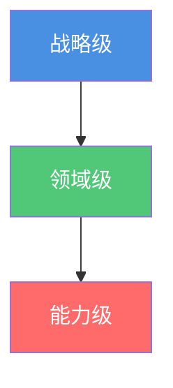
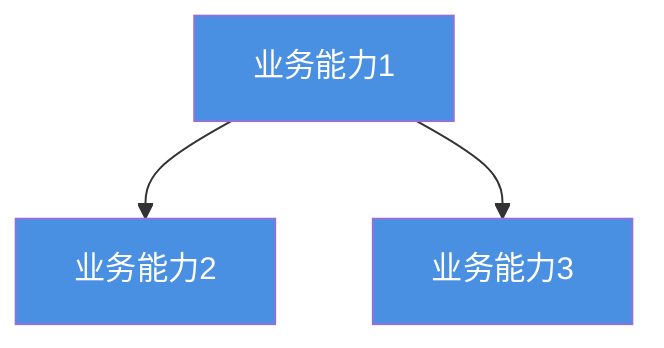

# 架构表示法指南

**创建日期**: {{date}}  
**制定者**: {{author}}  
**版本**: {{version}}  
**状态**: {{status}}

## 概述

本文档定义了企业架构的表示法规范，确保架构描述的一致性和可理解性。

## 表示法原则

### 原则 1: 一致性

{{principle1Description}}

### 原则 2: 清晰性

{{principle2Description}}

### 原则 3: 简洁性

{{principle3Description}}

## 图形表示法

### 架构层级

### 架构视图

| 视图类型 | 表示法                  | 说明                       |
| -------- | ----------------------- | -------------------------- |
| 业务视图 | {{businessNotation}}    | {{businessDescription}}    |
| 应用视图 | {{applicationNotation}} | {{applicationDescription}} |
| 数据视图 | {{dataNotation}}        | {{dataDescription}}        |
| 技术视图 | {{technologyNotation}}  | {{technologyDescription}}  |

## 符号规范

### 业务层符号

| 符号        | 含义         | 示例         |
| ----------- | ------------ | ------------ |
| {{symbol1}} | {{meaning1}} | {{example1}} |
| {{symbol2}} | {{meaning2}} | {{example2}} |

### 应用层符号

| 符号        | 含义         | 示例         |
| ----------- | ------------ | ------------ |
| {{symbol1}} | {{meaning1}} | {{example1}} |
| {{symbol2}} | {{meaning2}} | {{example2}} |

### 数据层符号

| 符号        | 含义         | 示例         |
| ----------- | ------------ | ------------ |
| {{symbol1}} | {{meaning1}} | {{example1}} |
| {{symbol2}} | {{meaning2}} | {{example2}} |

### 技术层符号

| 符号        | 含义         | 示例         |
| ----------- | ------------ | ------------ |
| {{symbol1}} | {{meaning1}} | {{example1}} |
| {{symbol2}} | {{meaning2}} | {{example2}} |

## 颜色规范

### 颜色含义

| 颜色           | 含义     | 使用场景           |
| -------------- | -------- | ------------------ |
| 蓝色 (#4a90e2) | 业务相关 | 业务能力、业务流程 |
| 绿色 (#50c878) | 应用相关 | 应用组件、应用服务 |
| 红色 (#ff6b6b) | 数据相关 | 数据实体、数据流   |
| 橙色 (#ffa500) | 技术相关 | 技术组件、基础设施 |

### 状态颜色

| 颜色 | 状态     | 说明     |
| ---- | -------- | -------- |
| 灰色 | 基线状态 | 当前架构 |
| 绿色 | 目标状态 | 目标架构 |
| 黄色 | 过渡状态 | 过渡架构 |

## 文本表示法

### 命名规范

{{namingConventions}}

### 标识符规范

{{identifierConventions}}

## 图表类型

### 架构图类型

| 图表类型 | 用途                  | 表示法                 |
| -------- | --------------------- | ---------------------- |
| 上下文图 | {{contextPurpose}}    | {{contextNotation}}    |
| 容器图   | {{containerPurpose}}  | {{containerNotation}}  |
| 组件图   | {{componentPurpose}}  | {{componentNotation}}  |
| 部署图   | {{deploymentPurpose}} | {{deploymentNotation}} |

## 工具支持

### 推荐工具

- **Mermaid**: {{mermaidDescription}}
- **PlantUML**: {{plantumlDescription}}
- **Archimate**: {{archimateDescription}}

### 工具配置

{{toolConfiguration}}

## 示例

### 示例 1: 业务能力图

### 示例 2: 应用架构图

## 检查清单

在创建架构图时，请检查：

- [ ] 使用了正确的符号
- [ ] 颜色符合规范
- [ ] 命名符合规范
- [ ] 关系类型正确
- [ ] 图表清晰易懂

## 相关文档

- [[概念定义]]
- [[关系定义]]
- [[架构元模型概览]]

## 变更记录

| 日期     | 版本 | 变更内容 | 变更人     |
| -------- | ---- | -------- | ---------- |
| {{date}} | 1.0  | 初始版本 | {{author}} |
