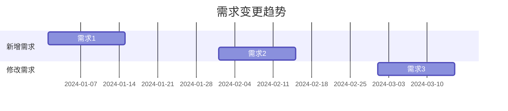

# 需求变更日志

**创建日期**: {{date}}  
**维护者**: {{maintainer}}  
**版本**: {{version}}  
**状态**: {{status}}

## 概述

本文档记录了所有架构需求的变更历史，包括变更原因、影响分析和审批信息。

## 变更记录

| 变更ID | 需求ID | 变更日期 | 变更类型 | 变更内容 | 变更原因 | 影响分析 | 变更人 | 审批人 | 状态 |
|--------|--------|---------|---------|---------|---------|---------|--------|--------|------|
| CHG-001 | REQ-001 | {{date1}} | {{type1}} | {{content1}} | {{reason1}} | {{impact1}} | {{changer1}} | {{approver1}} | {{status1}} |
| CHG-002 | REQ-002 | {{date2}} | {{type2}} | {{content2}} | {{reason2}} | {{impact2}} | {{changer2}} | {{approver2}} | {{status2}} |

## 变更类型说明

- **新增**: 新增需求
- **修改**: 修改现有需求
- **删除**: 删除需求
- **暂停**: 暂停需求实施
- **恢复**: 恢复暂停的需求

## 变更影响分析

### 高影响变更

{{highImpactChanges}}

### 中影响变更

{{mediumImpactChanges}}

### 低影响变更

{{lowImpactChanges}}

## 变更统计

### 按类型统计

| 变更类型 | 数量 | 占比 |
|---------|------|------|
| 新增 | {{count1}} | {{percentage1}} |
| 修改 | {{count2}} | {{percentage2}} |
| 删除 | {{count3}} | {{percentage3}} |

### 按时间统计

{{timeBasedStatistics}}

## 变更趋势

## 相关文档

- [[需求追溯矩阵]]
- [[架构需求]]

## 变更记录

| 日期     | 版本 | 变更内容     | 变更人     |
| -------- | ---- | ------------ | ---------- |
| {{date}} | 1.0  | 初始版本     | {{maintainer}} |

