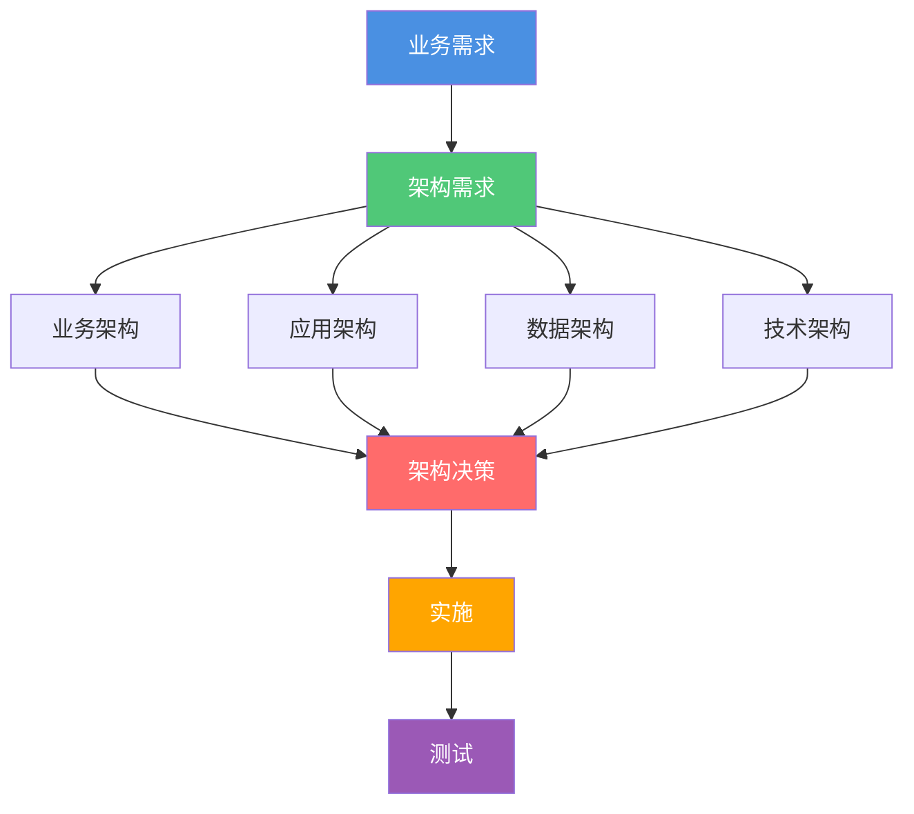

# 需求追溯矩阵

**创建日期**: {{date}}  
**维护者**: {{maintainer}}  
**版本**: {{version}}  
**状态**: {{status}}

## 概述

本文档提供了需求与架构元素之间的追溯矩阵，确保所有需求都有对应的架构实现，所有架构元素都有明确的需求来源。

## 需求追溯矩阵

| 需求ID | 需求名称 | 需求类型 | 业务架构 | 应用架构 | 数据架构 | 技术架构 | 架构决策 | 测试用例 | 状态 |
|--------|---------|---------|---------|---------|---------|---------|---------|---------|------|
| REQ-001 | {{requirement1}} | {{type1}} | {{ba1}} | {{aa1}} | {{da1}} | {{ta1}} | {{ad1}} | {{tc1}} | {{status1}} |
| REQ-002 | {{requirement2}} | {{type2}} | {{ba2}} | {{aa2}} | {{da2}} | {{ta2}} | {{ad2}} | {{tc2}} | {{status2}} |
| REQ-003 | {{requirement3}} | {{type3}} | {{ba3}} | {{aa3}} | {{da3}} | {{ta3}} | {{ad3}} | {{tc3}} | {{status3}} |

## 追溯关系图

## 需求覆盖分析

### 已覆盖需求

{{coveredRequirements}}

### 未覆盖需求

{{uncoveredRequirements}}

### 需求覆盖率

{{coveragePercentage}}

## 架构元素追溯

### 业务架构元素追溯

| 架构元素 | 关联需求 | 实现状态 |
|---------|---------|---------|
| {{element1}} | {{requirements1}} | {{status1}} |
| {{element2}} | {{requirements2}} | {{status2}} |

### 应用架构元素追溯

| 架构元素 | 关联需求 | 实现状态 |
|---------|---------|---------|
| {{element1}} | {{requirements1}} | {{status1}} |
| {{element2}} | {{requirements2}} | {{status2}} |

## 变更记录

| 日期     | 版本 | 变更内容     | 变更人     |
| -------- | ---- | ------------ | ---------- |
| {{date}} | 1.0  | 初始版本     | {{maintainer}} |

