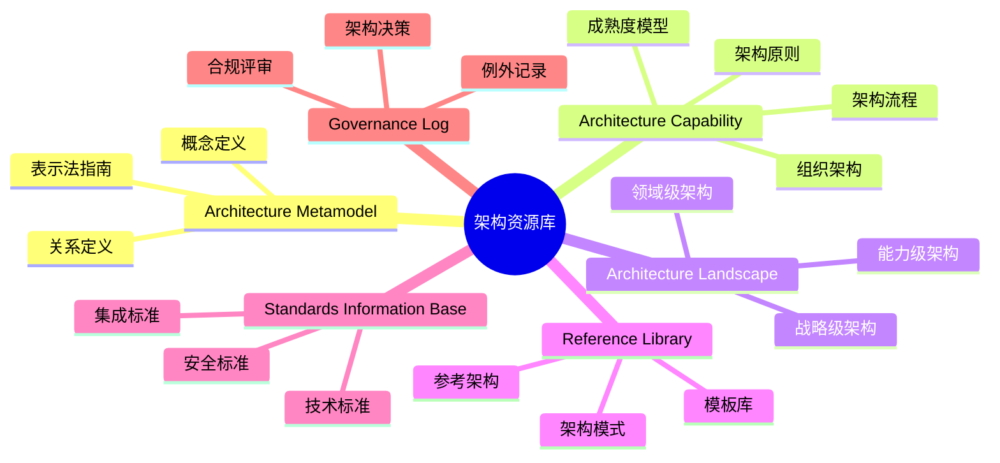
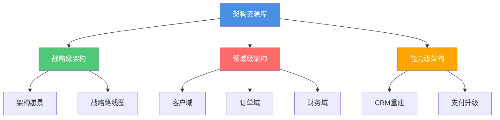

# {{organizationName}} 架构景观库（Architecture Repository）

**版本**: {{version}}  
**创建日期**: {{date}}  
**维护者**: {{maintainer}}  
**状态**: {{status}}

## 概述

本文档库是 {{organizationName}} 的企业架构景观库（Architecture Repository），基于 **TOGAF 标准**构建，用于存储、管理和维护企业架构的所有相关信息。

架构景观库是企业架构治理的核心资产，提供：

- 📋 **架构知识管理**: 统一的架构知识存储和检索
- 🎯 **架构决策支持**: 为架构决策提供历史依据和参考
- 🔄 **架构演进追踪**: 记录架构从基线到目标的演进过程
- 📊 **架构合规性**: 确保架构设计符合标准和原则
- 🔍 **架构可追溯性**: 所有架构决策和变更可追溯

## TOGAF 架构资源库结构

本架构资源库遵循 TOGAF 标准，包含以下 **6 大核心区**：

## 目录结构

### 1. Architecture Metamodel（架构元模型）

定义架构概念、关系和表示法，确保架构描述的一致性。

**关键文档**:
- [[架构概念定义]]
- [[关系定义]]
- [[表示法指南]]

### 2. Architecture Capability（架构能力）

说明企业如何做架构，包括组织、流程、原则和工具。

**关键文档**:
- [[架构委员会]]
- [[角色与职责]]
- [[ADM流程]]
- [[架构评审流程]]
- [[架构原则]]
- [[架构成熟度模型]]
- [[工具链]]

### 3. Architecture Landscape（架构景观）

描述企业当前/目标/过渡的整体架构，包含三层视角：

#### 3.1 Strategic Architecture（战略级架构）

面向 **3-5 年**，给高层看的战略级架构。

**关键文档**:
- [[架构愿景声明]]
- [[架构目标]]
- [[利益相关者分析]]
- [[范围与约束]]
- [[目标状态概览]]
- [[战略路线图]]
- [[原则对齐]]

#### 3.2 Segment Architecture（领域架构）

面向 **业务域/BU**，DDD/微服务拆分的核心落点。

**关键文档**:
- [[业务架构]]
- [[应用架构]]
- [[数据架构]]
- [[技术架构]]
- [[过渡计划]]

#### 3.3 Capability Architecture（能力级架构）

面向 **具体项目/产品**，项目立项、架构评审用。

**关键文档**:
- [[架构定义]]
- [[解决方案架构]]
- [[实施计划]]

### 4. Reference Library（参考库）

可复用的架构资产，包括模式、参考架构和模板。

**关键文档**:
- [[架构模式]]
- [[参考架构]]
- [[模板库]]
- [[评审检查清单]]

### 5. Standards Information Base（标准信息库）

必须遵守的技术、安全和集成标准。

**关键文档**:
- [[技术标准]]
- [[安全标准]]
- [[集成标准]]

### 6. Governance Log（治理记录）

架构决策、合规评审和例外记录的留痕。

**关键文档**:
- [[架构决策记录（ADR）]]
- [[合规评审]]
- [[标准例外]]

## 快速导航

### 按架构层级导航

### 按架构域导航

- **业务架构**: [[业务能力地图]] | [[价值流]] | [[业务流程]]
- **应用架构**: [[应用组件]] | [[应用服务]] | [[接口定义]]
- **数据架构**: [[数据域]] | [[数据模型]] | [[数据流]]
- **技术架构**: [[技术平台]] | [[基础设施]] | [[安全架构]]

## 使用指南

### 如何查找架构信息

1. **按层级查找**: 从战略级 → 领域级 → 能力级
2. **按域查找**: 从业务域 → 应用域 → 数据域 → 技术域
3. **按状态查找**: 基线架构 → 目标架构 → 过渡架构

### 如何创建新文档

1. 使用相应的模板创建文档
2. 遵循命名规范和目录结构
3. 确保文档链接正确
4. 提交架构委员会评审

### 如何更新文档

1. 遵循变更管理流程
2. 更新变更记录
3. 通知相关利益相关者

## 架构治理

### 架构委员会

详见 [[架构委员会章程]]

### 架构评审

详见 [[架构评审流程]]

### 架构决策

所有架构决策记录在 [[架构决策记录]] 中。

## 相关资源

### 外部参考

- [TOGAF 标准](https://www.opengroup.org/togaf)
- [Archimate 规范](https://www.opengroup.org/archimate)
- [C4 Model](https://c4model.com/)

### 内部资源

- [[架构元模型]]
- [[架构能力框架]]
- [[参考库]]
- [[标准信息库]]

## 维护信息

### 维护团队

{{maintenanceTeam}}

### 更新频率

{{updateFrequency}}

### 联系方式

{{contactInformation}}

## 变更记录

| 日期     | 版本 | 变更内容     | 变更人     |
| -------- | ---- | ------------ | ---------- |
| {{date}} | 1.0  | 初始版本     | {{maintainer}} |

