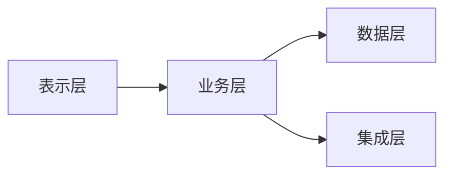
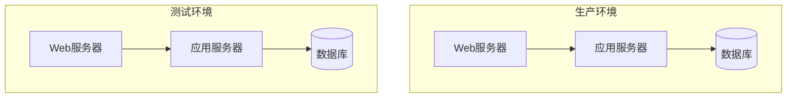
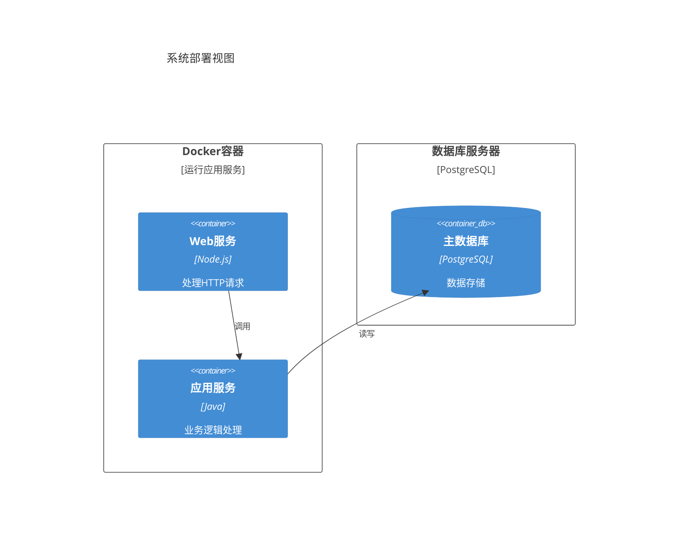

# {{projectName}} 架构概览

**创建日期**: {{date}}  
**架构师**: {{architect}}  
**架构类型**: {{architectureType}}

## 架构目标

{{architectureGoal}}

## 架构原则

1. **原则1**: 说明
2. **原则2**: 说明
3. **原则3**: 说明

## 架构视图

### 逻辑视图

{{logicalViewDescription}}

**逻辑架构图**（Mermaid 流程图）：

**逻辑架构图**（Archimate）：
参考 [[架构图.逻辑视图.archimate]]

### 物理视图

{{physicalViewDescription}}

**物理部署图**（Mermaid 流程图）：

**物理架构图**（Archimate）：
参考 [[架构图.物理视图.archimate]]

### 部署视图

{{deploymentViewDescription}}

**部署架构图**（Mermaid 架构图）：

## 技术栈

### 前端技术

- 技术1
- 技术2

### 后端技术

- 技术1
- 技术2

### 基础设施

- 技术1
- 技术2

## 架构决策

详见 [[架构决策记录]]

## 相关文档

- [[需求文档]]
- [[设计文档]]

## 变更记录

| 日期 | 版本 | 变更内容 | 变更人 |
|------|------|----------|--------|
| {{date}} | 1.0 | 初始版本 | {{architect}} |

