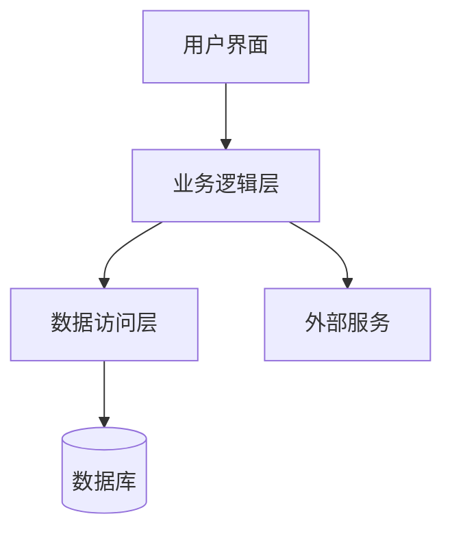
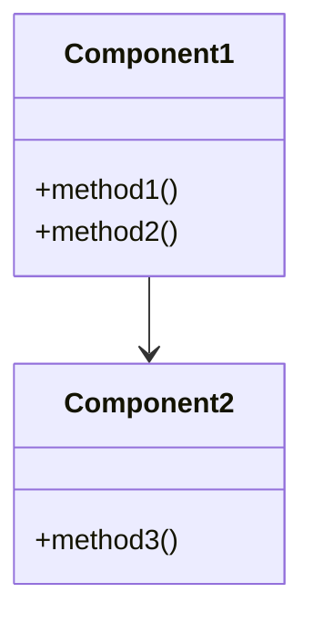

# {{systemName}} 设计概览

**创建日期**: {{date}}  
**设计者**: {{designer}}  
**状态**: 设计中

## 设计目标

{{designGoal}}

## 系统架构

### 整体架构

{{architectureDescription}}

#### 架构图

可以使用 Mermaid 流程图或 Archimate 图来展示系统架构：

**Mermaid 流程图示例**：

**Archimate 架构图**：
参考 [[架构图.系统架构图.archimate]]

### 核心组件

1. **组件1**: 描述
2. **组件2**: 描述
3. **组件3**: 描述

#### 组件关系图

可以使用 Mermaid 类图展示组件关系：

## 技术选型

| 技术 | 版本 | 说明 |
|------|------|------|
| 技术1 | v1.0 | 说明 |
| 技术2 | v2.0 | 说明 |

## 设计约束

- 约束1
- 约束2
- 约束3

## 相关文档

- [[需求文档]]
- [[架构文档]]

## 变更记录

| 日期 | 版本 | 变更内容 | 变更人 |
|------|------|----------|--------|
| {{date}} | 1.0 | 初始版本 | {{designer}} |

