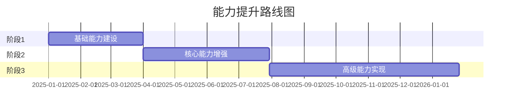

# {{capabilityName}} 目标能力

**创建日期**: {{date}}  
**架构师**: {{architect}}  
**版本**: {{version}}  
**状态**: {{status}}

## 概述

本文档描述了 {{capabilityName}} 的目标能力状态，包括目标能力定义、目标架构、能力提升路径和成功标准。

## 目标能力定义

### 能力愿景

{{capabilityVision}}

### 目标能力范围

{{targetCapabilityScope}}

### 目标能力边界

{{targetCapabilityBoundaries}}

## 目标架构

### 目标业务能力

{{targetBusinessCapability}}

### 目标应用能力

{{targetApplicationCapability}}

### 目标数据能力

{{targetDataCapability}}

### 目标技术能力

{{targetTechnologyCapability}}

## 能力提升路径

### 提升阶段



### 关键里程碑

| 里程碑 | 目标日期 | 关键成果 | 成功标准 |
|--------|---------|---------|---------|
| {{milestone1}} | {{date1}} | {{outcome1}} | {{criteria1}} |
| {{milestone2}} | {{date2}} | {{outcome2}} | {{criteria2}} |
| {{milestone3}} | {{date3}} | {{outcome3}} | {{criteria3}} |

## 目标能力指标

### 性能目标

| 指标名称 | 当前值 | 目标值 | 提升幅度 | 单位 | 说明 |
|---------|--------|--------|---------|------|------|
| {{metric1}} | {{current1}} | {{target1}} | {{improvement1}} | {{unit1}} | {{note1}} |
| {{metric2}} | {{current2}} | {{target2}} | {{improvement2}} | {{unit2}} | {{note2}} |

### 质量目标

| 指标名称 | 当前值 | 目标值 | 提升幅度 | 单位 | 说明 |
|---------|--------|--------|---------|------|------|
| {{qualityMetric1}} | {{qualityCurrent1}} | {{qualityTarget1}} | {{qualityImprovement1}} | {{qualityUnit1}} | {{qualityNote1}} |
| {{qualityMetric2}} | {{qualityCurrent2}} | {{qualityTarget2}} | {{qualityImprovement2}} | {{qualityUnit2}} | {{qualityNote2}} |

## 目标架构视图

```mermaid
graph TB
    A[{{capabilityName}} 目标能力] --> B[目标业务层]
    A --> C[目标应用层]
    A --> D[目标数据层]
    A --> E[目标技术层]
    
    B --> B1[目标业务能力]
    C --> C1[目标应用能力]
    D --> D1[目标数据能力]
    E --> E1[目标技术能力]
    
    style A fill:#4a90e2,color:#fff
    style B fill:#50c878,color:#fff
    style C fill:#ff6b6b,color:#fff
    style D fill:#ffa500,color:#fff
    style E fill:#9b59b6,color:#fff
```

## 能力差距分析

### 从当前到目标的差距

{{gapAnalysis}}

### 关键改进领域

{{keyImprovementAreas}}

## 成功标准

### 业务成功标准

{{businessSuccessCriteria}}

### 技术成功标准

{{technicalSuccessCriteria}}

### 质量成功标准

{{qualitySuccessCriteria}}

## 目标成熟度

### 目标成熟度等级

| 维度 | 当前等级 | 目标等级 | 提升计划 |
|------|---------|---------|---------|
| 业务成熟度 | {{currentBusinessMaturity}} | {{targetBusinessMaturity}} | {{businessPlan}} |
| 应用成熟度 | {{currentApplicationMaturity}} | {{targetApplicationMaturity}} | {{applicationPlan}} |
| 数据成熟度 | {{currentDataMaturity}} | {{targetDataMaturity}} | {{dataPlan}} |
| 技术成熟度 | {{currentTechnologyMaturity}} | {{targetTechnologyMaturity}} | {{technologyPlan}} |
| **综合成熟度** | **{{currentOverallMaturity}}** | **{{targetOverallMaturity}}** | **{{overallPlan}}** |

## 相关文档

- [[当前能力]]
- [[能力增量]]
- [[相关领域架构]]

## 变更记录

| 日期 | 版本 | 变更内容 | 变更人 |
|------|------|----------|--------|
| {{date}} | 1.0 | 初始版本 | {{architect}} |

