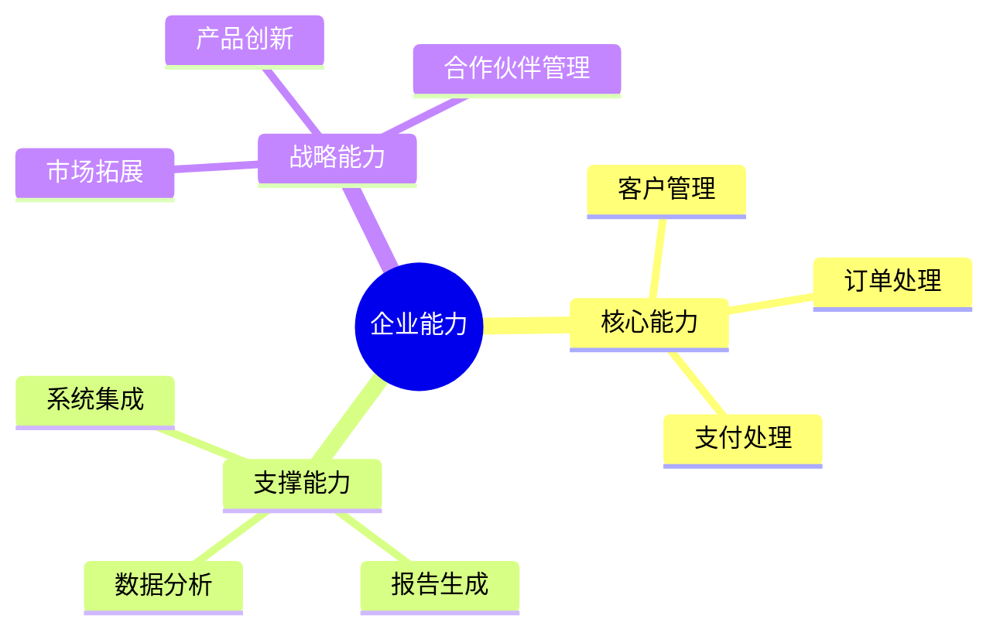
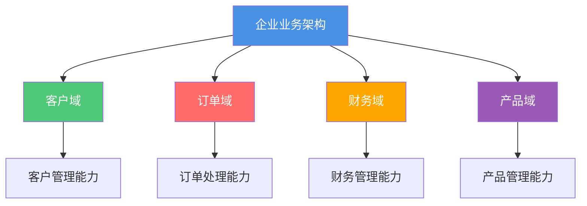

# 企业级业务架构

**创建日期**: {{date}}  
**架构师**: {{architect}}  
**版本**: {{version}}  
**状态**: {{status}}

## 概述

本文档描述了企业级的业务架构，提供跨领域的业务视图，包括企业能力地图、价值流、业务流程和业务术语表。

## 企业能力地图

### 能力概览

{{enterpriseCapabilityOverview}}

### 能力分类

### 能力成熟度

{{capabilityMaturity}}

## 企业价值流

### 价值流概览

{{enterpriseValueStreams}}

### 关键价值流

| 价值流ID | 价值流名称 | 描述 | 关键阶段 |
|---------|-----------|------|---------|
| VS-001 | {{valueStream1}} | {{description1}} | {{stages1}} |
| VS-002 | {{valueStream2}} | {{description2}} | {{stages2}} |

## 企业业务流程

### 流程概览

{{enterpriseProcesses}}

### 关键业务流程

| 流程ID | 流程名称 | 描述 | 所属域 |
|--------|---------|------|--------|
| PROC-001 | {{process1}} | {{description1}} | {{domain1}} |
| PROC-002 | {{process2}} | {{description2}} | {{domain2}} |

## 业务术语表

{{businessGlossary}}

## 跨领域业务视图

## 相关文档

- [[企业应用架构]]
- [[企业数据架构]]
- [[企业技术架构]]
- [[领域架构]]

## 变更记录

| 日期     | 版本 | 变更内容 | 变更人     |
| -------- | ---- | -------- | ---------- |
| {{date}} | 1.0  | 初始版本 | {{architect}} |

