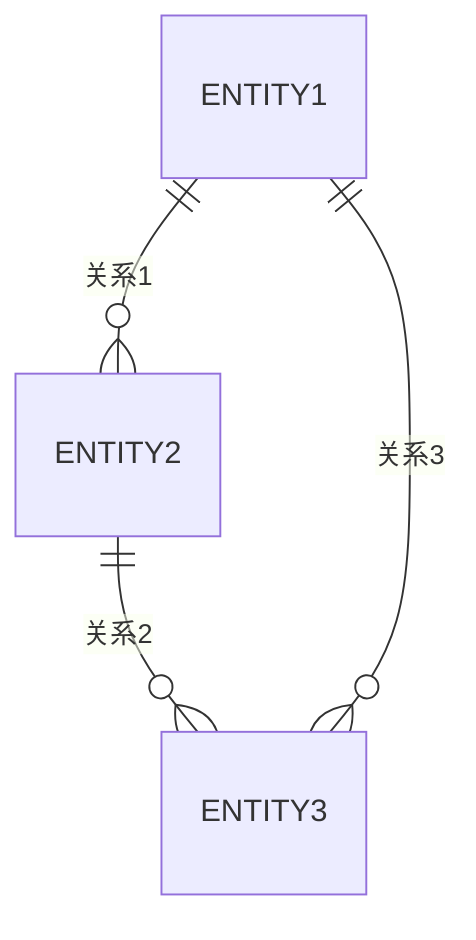
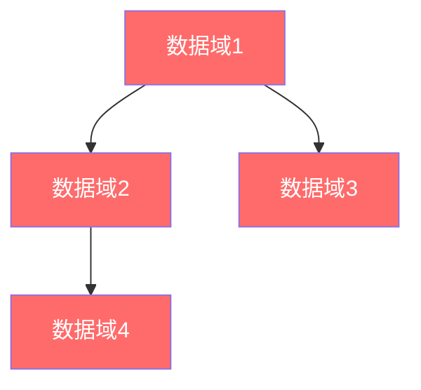

# 企业级数据架构

**创建日期**: {{date}}  
**架构师**: {{architect}}  
**版本**: {{version}}  
**状态**: {{status}}

## 概述

本文档描述了企业级的数据架构，提供跨领域的数据视图，包括企业数据模型、数据域、数据治理和数据生命周期。

## 企业数据模型

### 数据模型概览

{{enterpriseDataModelOverview}}

### 核心数据实体

| 实体ID | 实体名称 | 实体描述 | 所属域 | 关键属性 |
|--------|---------|---------|--------|---------|
| ENT-001 | {{entity1}} | {{description1}} | {{domain1}} | {{attributes1}} |
| ENT-002 | {{entity2}} | {{description2}} | {{domain2}} | {{attributes2}} |

### 数据实体关系

## 企业数据域

### 数据域划分

{{dataDomainDivision}}

### 数据域列表

| 数据域ID | 数据域名称 | 数据域描述 | 数据所有者 | 关键实体 |
|---------|-----------|-----------|-----------|---------|
| DOM-001 | {{domain1}} | {{description1}} | {{owner1}} | {{entities1}} |
| DOM-002 | {{domain2}} | {{description2}} | {{owner2}} | {{entities2}} |

### 数据域关系

## 企业数据治理

### 数据治理框架

{{dataGovernanceFramework}}

### 数据所有权矩阵

{{dataOwnershipMatrix}}

### 数据分类标准

{{dataClassificationStandards}}

## 数据生命周期

### 生命周期阶段

{{dataLifecycleStages}}

### 数据流转

## 数据质量

### 数据质量指标

{{dataQualityMetrics}}

### 数据质量监控

{{dataQualityMonitoring}}

## 相关文档

- [[企业业务架构]]
- [[企业应用架构]]
- [[企业技术架构]]
- [[领域架构]]

## 变更记录

| 日期     | 版本 | 变更内容 | 变更人     |
| -------- | ---- | -------- | ---------- |
| {{date}} | 1.0  | 初始版本 | {{architect}} |

