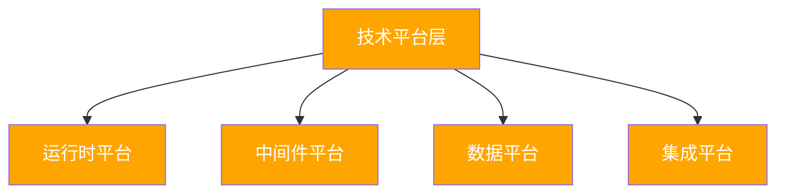
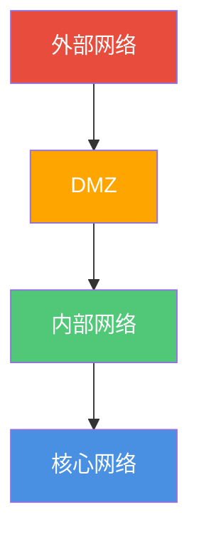
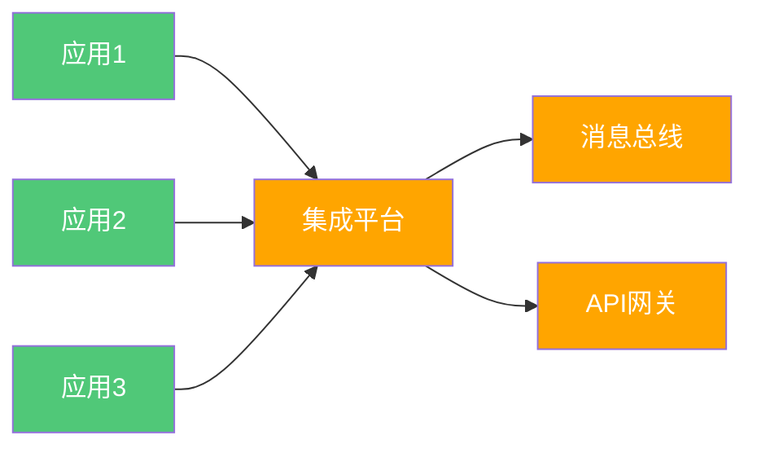

# 企业级技术架构

**创建日期**: {{date}}  
**架构师**: {{architect}}  
**版本**: {{version}}  
**状态**: {{status}}

## 概述

本文档描述了企业级的技术架构，提供跨领域的技术视图，包括技术平台、基础设施、安全架构和集成架构。

## 企业技术平台

### 技术平台概览

{{technologyPlatformOverview}}

### 技术栈

| 技术类别 | 技术选型 | 版本 | 使用范围 | 说明 |
|---------|---------|------|---------|------|
| {{category1}} | {{technology1}} | {{version1}} | {{scope1}} | {{description1}} |
| {{category2}} | {{technology2}} | {{version2}} | {{scope2}} | {{description2}} |

### 技术平台架构

## 企业基础设施

### 基础设施概览

{{infrastructureOverview}}

### 基础设施组件

| 组件ID | 组件名称 | 组件类型 | 位置 | 状态 |
|--------|---------|---------|------|------|
| INF-001 | {{component1}} | {{type1}} | {{location1}} | {{status1}} |
| INF-002 | {{component2}} | {{type2}} | {{location2}} | {{status2}} |

### 基础设施拓扑

{{infrastructureTopology}}

## 企业安全架构

### 安全架构概览

{{securityArchitectureOverview}}

### 安全控制措施

| 控制ID | 控制措施 | 控制类型 | 适用范围 |
|--------|---------|---------|---------|
| SEC-001 | {{control1}} | {{type1}} | {{scope1}} |
| SEC-002 | {{control2}} | {{type2}} | {{scope2}} |

### 安全边界

## 企业集成架构

### 集成架构概览

{{integrationArchitectureOverview}}

### 集成模式

| 模式ID | 集成模式 | 使用场景 | 技术实现 |
|--------|---------|---------|---------|
| INT-PAT-001 | {{pattern1}} | {{scenario1}} | {{implementation1}} |
| INT-PAT-002 | {{pattern2}} | {{scenario2}} | {{implementation2}} |

### 集成架构图

## 技术标准合规

### 技术标准遵循情况

{{technologyStandardsCompliance}}

## 相关文档

- [[企业业务架构]]
- [[企业应用架构]]
- [[企业数据架构]]
- [[领域架构]]

## 变更记录

| 日期     | 版本 | 变更内容 | 变更人     |
| -------- | ---- | -------- | ---------- |
| {{date}} | 1.0  | 初始版本 | {{architect}} |

