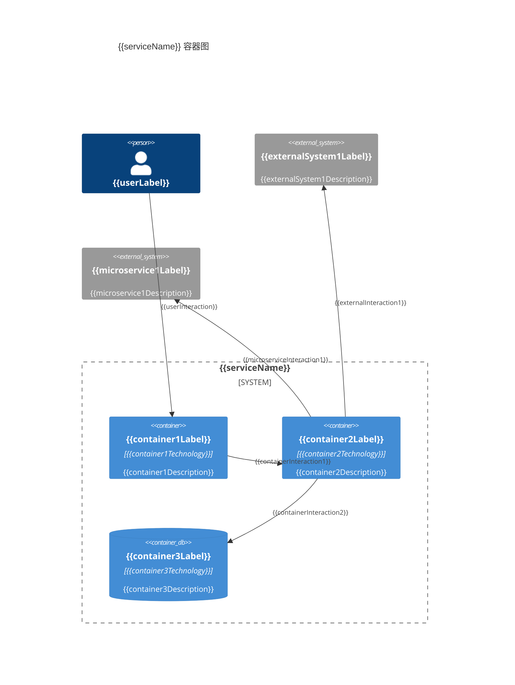
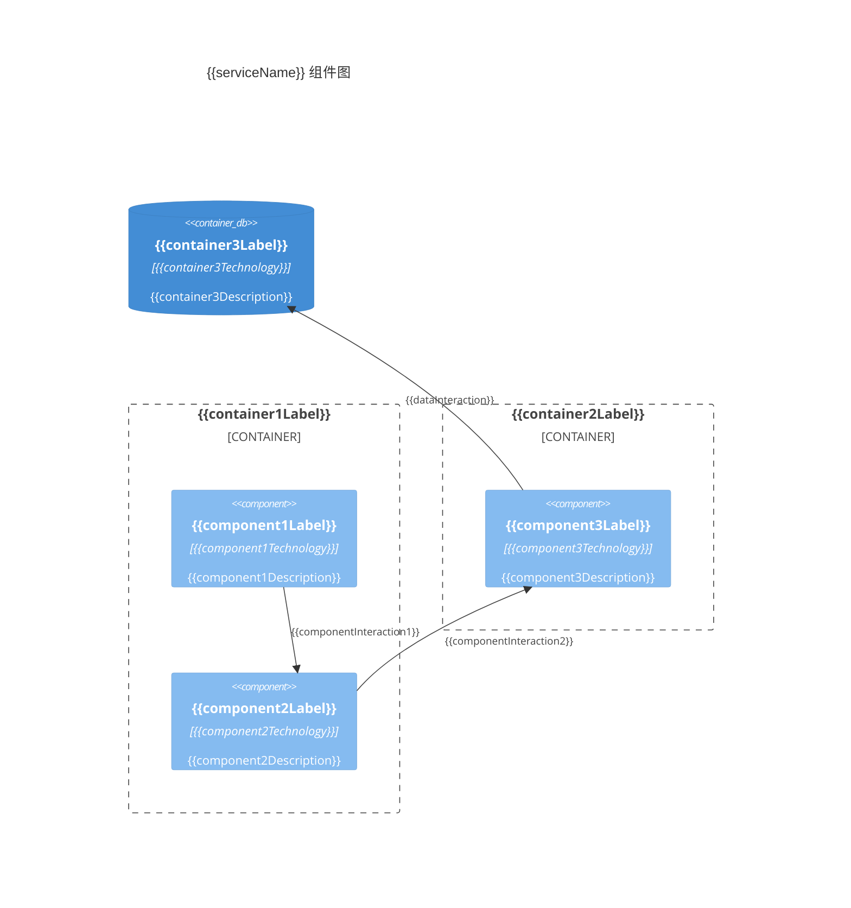
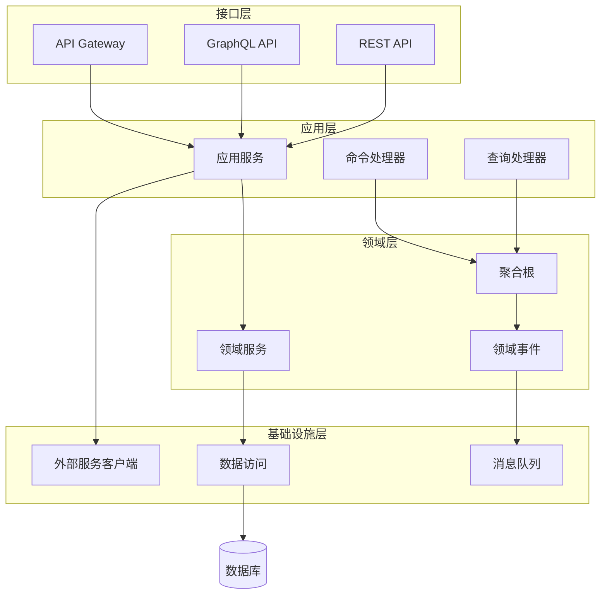

# {{serviceName}} 架构概览

**创建日期**: {{date}}  
**架构师**: {{architect}}  
**版本**: 1.0

## 概述

本文档描述 {{serviceName}} 微服务的整体架构，包括容器图（C4 Level 2）和组件图（C4 Level 3）。

## 架构原则

1. **{{principle1}}**: {{principleDescription1}}
2. **{{principle2}}**: {{principleDescription2}}
3. **{{principle3}}**: {{principleDescription3}}

## 容器图（C4 Level 2）

### 容器清单

| 容器名称 | 技术 | 职责 | 状态 |
|---------|------|------|------|
| {{container1}} | {{technology1}} | {{responsibility1}} | {{status1}} |
| {{container2}} | {{technology2}} | {{responsibility2}} | {{status2}} |
| {{container3}} | {{technology3}} | {{responsibility3}} | {{status3}} |

### 容器图

## 组件图（C4 Level 3）

### 组件清单

| 组件名称 | 职责 | 所属容器 |
|---------|------|---------|
| {{component1}} | {{responsibility1}} | {{container1}} |
| {{component2}} | {{responsibility2}} | {{container2}} |
| {{component3}} | {{responsibility3}} | {{container2}} |

### 组件图

## 分层架构

### 架构层次

{{layeredArchitectureDescription}}

### 分层架构图

## 技术选型

| 层次 | 技术栈 | 选型理由 |
|------|--------|---------|
| {{layer1}} | {{techStack1}} | {{rationale1}} |
| {{layer2}} | {{techStack2}} | {{rationale2}} |

## 数据流

{{dataFlowDescription}}

## 安全边界

{{securityBoundaryDescription}}

## 相关文档

- [[service-overview.md]] - 服务概览
- [[context-diagram.md]] - 系统上下文图
- [[../02-domain/domain-overview.md]] - 领域概览
- [[../03-apis/rest-api.md]] - REST API文档

## 变更记录

| 日期 | 版本 | 变更内容 | 变更人 |
|------|------|----------|--------|
| {{date}} | 1.0 | 初始版本 | {{architect}} |

