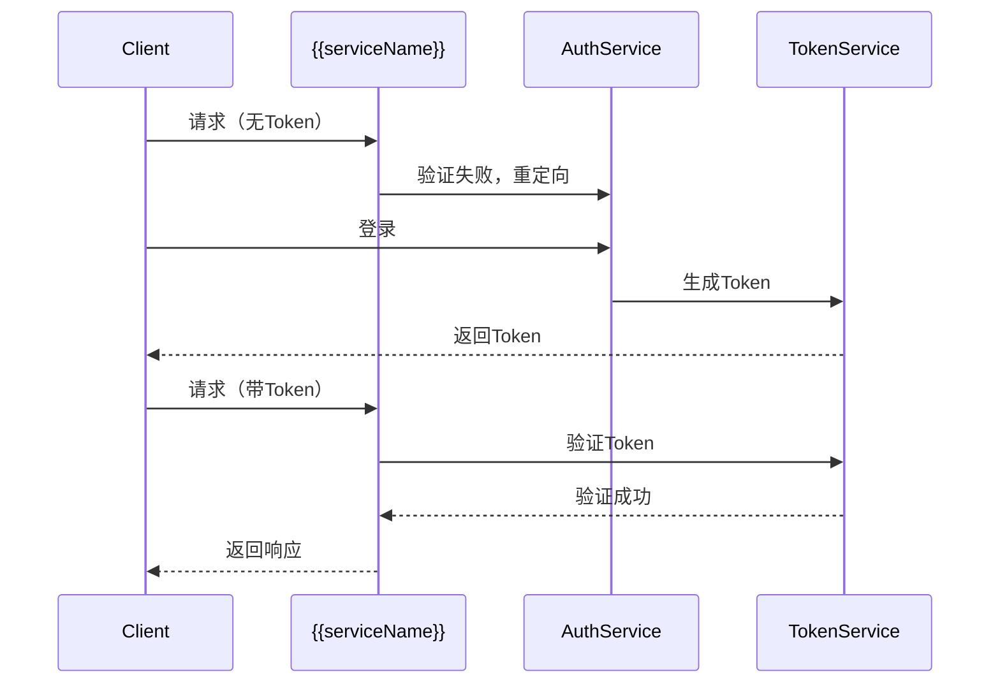
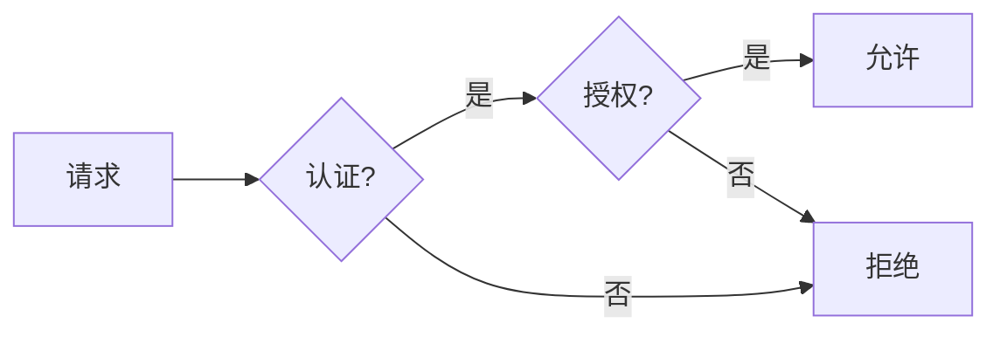

# {{serviceName}} 鉴权认证策略

**创建日期**: {{date}}  
**安全工程师**: {{securityEngineer}}  
**版本**: 1.0

## 概述

本文档定义 {{serviceName}} 微服务的认证（Authentication）和授权（Authorization）策略。

## 认证策略

### 认证方式

{{authenticationMethod}}

### 认证流程

### Token 管理

{{tokenManagement}}

### 会话管理

{{sessionManagement}}

## 授权策略

### 授权模型

{{authorizationModel}}

### 角色定义

| 角色名称 | 描述 | 权限 |
|---------|------|------|
| {{role1}} | {{description1}} | {{permissions1}} |
| {{role2}} | {{description2}} | {{permissions2}} |

### 权限定义

| 权限名称 | 描述 | 资源 |
|---------|------|------|
| {{permission1}} | {{description1}} | {{resource1}} |
| {{permission2}} | {{description2}} | {{resource2}} |

### 授权流程

## 访问控制

### API 访问控制

{{apiAccessControl}}

### 数据访问控制

{{dataAccessControl}}

### 资源访问控制

{{resourceAccessControl}}

## 安全最佳实践

{{securityBestPractices}}

## 相关文档

- [[threat-model.md]] - 威胁建模
- [[data-protection.md]] - 数据保护
- [[audit.md]] - 审计日志规范

## 变更记录

| 日期 | 版本 | 变更内容 | 变更人 |
|------|------|----------|--------|
| {{date}} | 1.0 | 初始版本 | {{securityEngineer}} |

