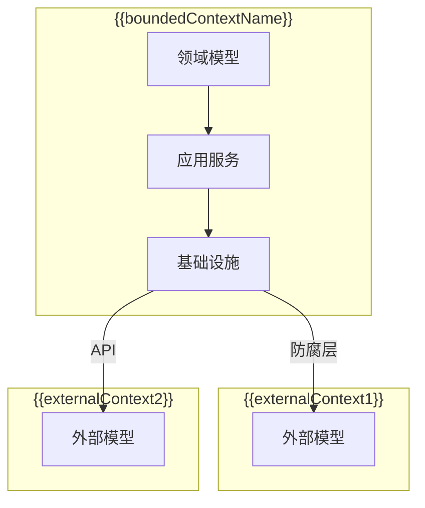

# {{serviceName}} 限界上下文

**创建日期**: {{date}}  
**领域专家**: {{domainExpert}}  
**版本**: 1.0

## 概述

本文档定义 {{serviceName}} 微服务的限界上下文（Bounded Context），包括上下文边界和上下文映射关系。

## 限界上下文定义

### 上下文名称

{{boundedContextName}}

### 上下文描述

{{boundedContextDescription}}

### 上下文边界

{{contextBoundary}}

## 上下文边界图

## 上下文映射关系

### 映射关系表

| 上下文名称 | 关系类型 | 描述 | 集成方式 |
|-----------|---------|------|---------|
| {{context1}} | {{relationshipType1}} | {{description1}} | {{integrationMethod1}} |
| {{context2}} | {{relationshipType2}} | {{description2}} | {{integrationMethod2}} |
| {{context3}} | {{relationshipType3}} | {{description3}} | {{integrationMethod3}} |

### 关系类型说明

#### 共享内核（Shared Kernel）

{{sharedKernelDescription}}

#### 客户-供应商（Customer-Supplier）

{{customerSupplierDescription}}

#### 遵奉者（Conformist）

{{conformistDescription}}

#### 防腐层（Anti-Corruption Layer）

{{antiCorruptionLayerDescription}}

#### 分离方式（Separate Ways）

{{separateWaysDescription}}

#### 发布-订阅（Publish-Subscribe）

{{publishSubscribeDescription}}

#### 伙伴关系（Partnership）

{{partnershipDescription}}

## 通用语言（Ubiquitous Language）

### 领域术语

| 术语 | 定义 | 使用场景 |
|------|------|---------|
| {{term1}} | {{definition1}} | {{usageScenario1}} |
| {{term2}} | {{definition2}} | {{usageScenario2}} |

### 术语映射

| 本上下文术语 | 外部上下文术语 | 映射关系 |
|------------|--------------|---------|
| {{localTerm1}} | {{externalTerm1}} | {{mappingRelation1}} |
| {{localTerm2}} | {{externalTerm2}} | {{mappingRelation2}} |

## 上下文边界规则

### 数据边界

{{dataBoundary}}

### 行为边界

{{behaviorBoundary}}

### 事务边界

{{transactionBoundary}}

## 集成点

### 输入集成点

| 集成点 | 来源上下文 | 集成方式 | 描述 |
|--------|-----------|---------|------|
| {{inputPoint1}} | {{sourceContext1}} | {{integrationMethod1}} | {{description1}} |
| {{inputPoint2}} | {{sourceContext2}} | {{integrationMethod2}} | {{description2}} |

### 输出集成点

| 集成点 | 目标上下文 | 集成方式 | 描述 |
|--------|-----------|---------|------|
| {{outputPoint1}} | {{targetContext1}} | {{integrationMethod1}} | {{description1}} |
| {{outputPoint2}} | {{targetContext2}} | {{integrationMethod2}} | {{description2}} |

## 相关文档

- [[domain-overview.md]] - 领域概览
- [[subdomain-mapping.md]] - 子领域映射
- [[glossary.md]] - 领域术语表

## 变更记录

| 日期 | 版本 | 变更内容 | 变更人 |
|------|------|----------|--------|
| {{date}} | 1.0 | 初始版本 | {{domainExpert}} |

