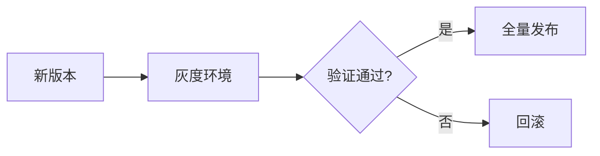
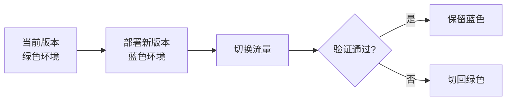

# {{serviceName}} CD 发布文档

**创建日期**: {{date}}  
**DevOps工程师**: {{devops}}  
**版本**: 1.0

## 概述

本文档描述 {{serviceName}} 微服务的持续部署（CD）策略，包括灰度发布、蓝绿发布等。

## 发布策略

### 发布类型

| 发布类型 | 描述 | 适用场景 |
|---------|------|---------|
| 灰度发布 | {{canaryDescription}} | {{canaryScenarios}} |
| 蓝绿发布 | {{blueGreenDescription}} | {{blueGreenScenarios}} |
| 滚动发布 | {{rollingDescription}} | {{rollingScenarios}} |

## 灰度发布

### 灰度发布流程

### 灰度比例

{{canaryPercentage}}

### 灰度验证

{{canaryValidation}}

### 灰度回滚

{{canaryRollback}}

## 蓝绿发布

### 蓝绿发布流程

### 蓝绿切换

{{blueGreenSwitch}}

### 蓝绿验证

{{blueGreenValidation}}

## 滚动发布

### 滚动发布配置

{{rollingUpdateConfiguration}}

### 滚动策略

{{rollingStrategy}}

## 发布流程

### 发布前检查

{{preReleaseChecks}}

### 发布步骤

1. {{releaseStep1}}
2. {{releaseStep2}}
3. {{releaseStep3}}

### 发布后验证

{{postReleaseValidation}}

## 回滚策略

### 回滚触发条件

{{rollbackTriggerConditions}}

### 回滚流程

{{rollbackProcess}}

## 发布监控

### 监控指标

{{monitoringMetrics}}

### 告警规则

{{alertRules}}

## 相关文档

- [[ci.md]] - CI流水线配置
- [[environments.md]] - 环境说明
- [[../05-operations/deployment.md]] - 部署架构

## 变更记录

| 日期 | 版本 | 变更内容 | 变更人 |
|------|------|----------|--------|
| {{date}} | 1.0 | 初始版本 | {{devops}} |

