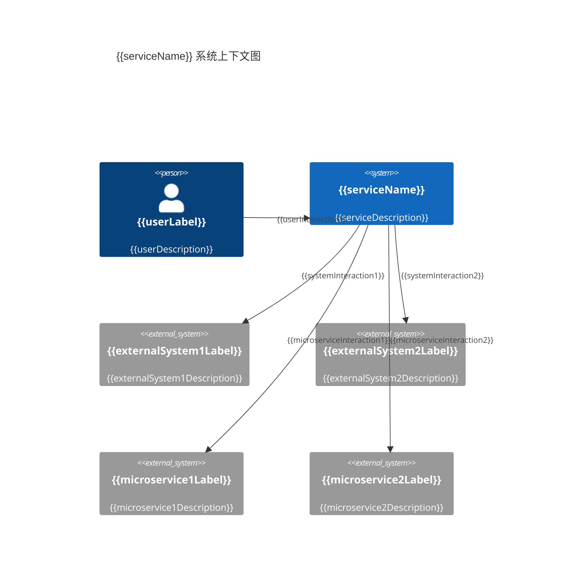

# {{serviceName}} 系统上下文图

**创建日期**: {{date}}  
**架构师**: {{architect}}  
**版本**: 1.0

## 概述

系统上下文图（System Context Diagram）是 C4 模型的第一层，用于展示微服务与外部用户和系统之间的高层次交互关系。

## 服务边界

{{serviceBoundaryDescription}}

## 系统用户

| 用户类型 | 描述 | 交互方式 |
|---------|------|---------|
| {{userType1}} | {{userDescription1}} | {{interactionMethod1}} |
| {{userType2}} | {{userDescription2}} | {{interactionMethod2}} |

## 外部系统

| 系统名称 | 类型 | 描述 | 交互方式 |
|---------|------|------|---------|
| {{externalSystem1}} | {{systemType1}} | {{systemDescription1}} | {{interactionMethod1}} |
| {{externalSystem2}} | {{systemType2}} | {{systemDescription2}} | {{interactionMethod2}} |

## 相关微服务

| 服务名称 | 关系类型 | 描述 | 交互方式 |
|---------|---------|------|---------|
| {{microservice1}} | {{relationshipType1}} | {{description1}} | {{interactionMethod1}} |
| {{microservice2}} | {{relationshipType2}} | {{description2}} | {{interactionMethod2}} |

## 系统上下文图

## 关键交互

1. **{{interaction1}}**: {{interactionDescription1}}
2. **{{interaction2}}**: {{interactionDescription2}}
3. **{{interaction3}}**: {{interactionDescription3}}

## 非功能性需求

- **性能**: {{performanceRequirement}}
- **可用性**: {{availabilityRequirement}}
- **安全性**: {{securityRequirement}}

## 相关文档

- [[service-overview.md]] - 服务概览
- [[architecture.md]] - 架构概览
- [[../02-domain/domain-overview.md]] - 领域概览

## 变更记录

| 日期 | 版本 | 变更内容 | 变更人 |
|------|------|----------|--------|
| {{date}} | 1.0 | 初始版本 | {{architect}} |

