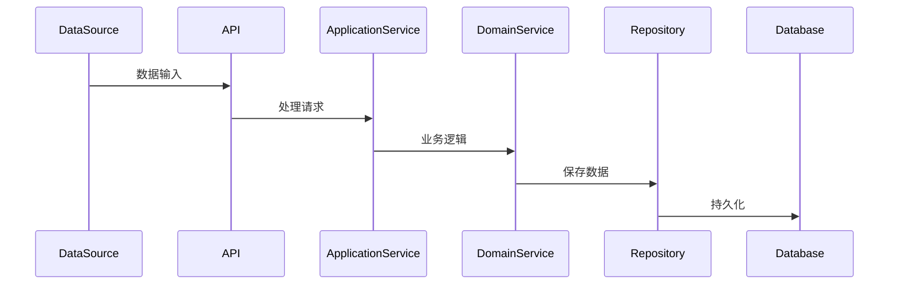
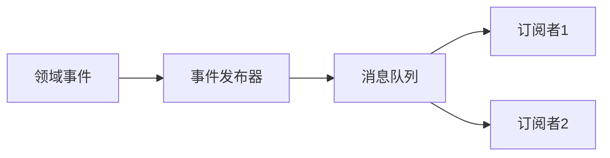

# {{serviceName}} 数据流说明

**创建日期**: {{date}}  
**架构师**: {{architect}}  
**版本**: 1.0

## 概述

本文档描述 {{serviceName}} 微服务的数据流和事件流。

## 数据流概览

### 数据流图

```mermaid
graph LR
    A[外部系统] -->|数据输入| B[{{serviceName}}]
    B -->|数据输出| C[下游服务]
    B -->|事件发布| D[消息队列]
    D -->|事件订阅| E[其他服务]
    B -->|数据存储| F[(数据库)]
```

## 数据输入流

### 输入数据源

| 数据源 | 数据类型 | 输入方式 | 频率 | 描述 |
|--------|---------|---------|------|------|
| {{dataSource1}} | {{dataType1}} | {{inputMethod1}} | {{frequency1}} | {{description1}} |
| {{dataSource2}} | {{dataType2}} | {{inputMethod2}} | {{frequency2}} | {{description2}} |

### 数据输入流程



## 数据输出流

### 输出数据目标

| 数据目标 | 数据类型 | 输出方式 | 频率 | 描述 |
|---------|---------|---------|------|------|
| {{dataTarget1}} | {{dataType1}} | {{outputMethod1}} | {{frequency1}} | {{description1}} |
| {{dataTarget2}} | {{dataType2}} | {{outputMethod2}} | {{frequency2}} | {{description2}} |

## 事件流

### 发布事件流



### 订阅事件流


### 事件流详细说明

| 事件名称 | 发布者 | 订阅者 | 数据内容 | 描述 |
|---------|--------|--------|---------|------|
| {{event1}} | {{publisher1}} | {{subscriber1}} | {{dataContent1}} | {{description1}} |
| {{event2}} | {{publisher2}} | {{subscriber2}} | {{dataContent2}} | {{description2}} |

## 数据一致性

### 最终一致性

{{eventualConsistency}}

### 事务边界

{{transactionBoundary}}

### 补偿机制

{{compensationMechanism}}

## 数据同步

### 同步策略

{{synchronizationStrategy}}

### 同步频率

{{synchronizationFrequency}}

## 数据流监控

### 监控指标

{{monitoringMetrics}}

### 告警规则

{{alertRules}}

## 相关文档

- [[schema.md]] - 数据库结构文档
- [[migration-history.md]] - 迁移历史
- [[../03-apis/event-api.md]] - 事件接口文档

## 变更记录

| 日期 | 版本 | 变更内容 | 变更人 |
|------|------|----------|--------|
| {{date}} | 1.0 | 初始版本 | {{architect}} |

