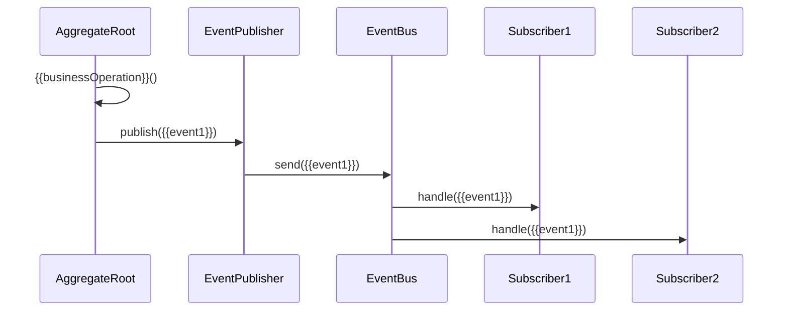

# {{subdomainName}} 领域事件定义

**创建日期**: {{date}}  
**领域专家**: {{domainExpert}}  
**版本**: 1.0

## 概述

本文档定义 {{subdomainName}} 子领域中的所有领域事件（Domain Events）。

## 领域事件列表

| 事件名称 | 英文名称 | 发布者 | 描述 | 优先级 |
|---------|---------|--------|------|--------|
| {{event1}} | {{englishName1}} | {{publisher1}} | {{description1}} | {{priority1}} |
| {{event2}} | {{englishName2}} | {{publisher2}} | {{description2}} | {{priority2}} |

## 领域事件详细说明

### {{event1}}

#### 事件定义

{{eventDefinition1}}

#### 事件属性

| 属性名称 | 类型 | 描述 | 必填 |
|---------|------|------|------|
| {{property1}} | {{type1}} | {{description1}} | {{required1}} |
| {{property2}} | {{type2}} | {{description2}} | {{required2}} |

#### 事件结构

```json
{
  "eventType": "{{event1}}",
  "eventId": "{{eventId}}",
  "timestamp": "{{timestamp}}",
  "aggregateId": "{{aggregateId}}",
  "aggregateType": "{{aggregateType}}",
  "version": {{version}},
  "data": {
    "{{property1}}": "{{value1}}",
    "{{property2}}": "{{value2}}"
  }
}
```

#### 发布者

{{publisher1}}

#### 发布时机

{{publishingTrigger1}}

#### 订阅者

| 订阅者 | 处理方式 | 描述 |
|--------|---------|------|
| {{subscriber1}} | {{handlingMethod1}} | {{description1}} |
| {{subscriber2}} | {{handlingMethod2}} | {{description2}} |

#### 事件流



### {{event2}}

#### 事件定义

{{eventDefinition2}}

#### 事件属性

| 属性名称 | 类型 | 描述 | 必填 |
|---------|------|------|------|
| {{property3}} | {{type3}} | {{description3}} | {{required3}} |

## 事件分类

### 生命周期事件

| 事件名称 | 描述 | 触发时机 |
|---------|------|---------|
| {{lifecycleEvent1}} | {{description1}} | {{trigger1}} |

### 状态变更事件

| 事件名称 | 描述 | 触发时机 |
|---------|------|---------|
| {{stateChangeEvent1}} | {{description1}} | {{trigger1}} |

### 业务事件

| 事件名称 | 描述 | 触发时机 |
|---------|------|---------|
| {{businessEvent1}} | {{description1}} | {{trigger1}} |

## 事件发布策略

### 发布模式

{{publishingPattern}}

### 事件存储

{{eventStorage}}

### 事件版本管理

{{eventVersioning}}

## 事件处理

### 同步处理

{{synchronousHandling}}

### 异步处理

{{asynchronousHandling}}

### 事件重放

{{eventReplay}}

## 事件关系

### 事件关系图

```mermaid
graph LR
    A[{{event1}}] --> B[{{event2}}]
    A --> C[{{event3}}]
    B --> D[{{event4}}]
```

### 事件链

{{eventChain}}

## 相关文档

- [[README.md]] - 子领域说明
- [[domain-model.md]] - 领域模型
- [[aggregates.md]] - 聚合根详细说明

## 变更记录

| 日期 | 版本 | 变更内容 | 变更人 |
|------|------|----------|--------|
| {{date}} | 1.0 | 初始版本 | {{domainExpert}} |

