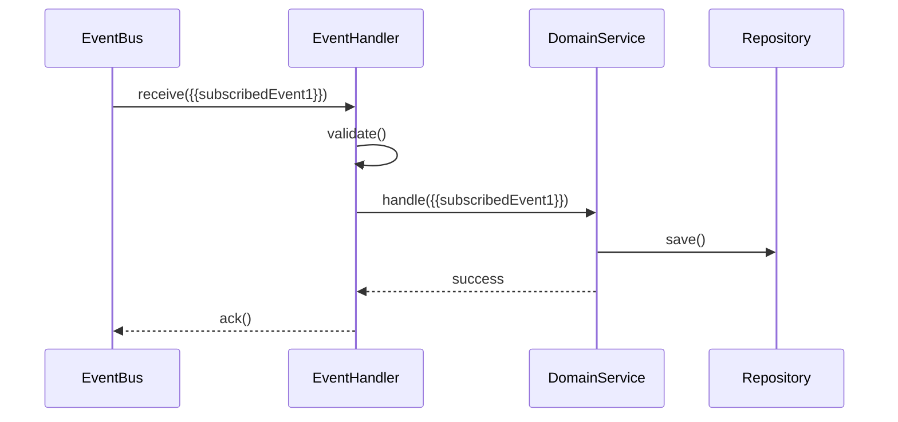

# {{serviceName}} 事件接口文档

**创建日期**: {{date}}  
**架构师**: {{architect}}  
**版本**: 1.0

## 概述

本文档定义 {{serviceName}} 微服务的事件接口（Event API），用于事件驱动架构中的服务间通信。

## 事件基础信息

### 消息中间件

{{messageMiddleware}}

### 事件格式

{{eventFormat}}

### 序列化方式

{{serializationMethod}}

## 发布事件列表

| 事件名称 | 事件类型 | 主题/队列 | 描述 |
|---------|---------|----------|------|
| {{event1}} | {{eventType1}} | {{topic1}} | {{description1}} |
| {{event2}} | {{eventType2}} | {{topic2}} | {{description2}} |

## 发布事件详细说明

### {{event1}}

#### 事件信息

- **事件名称**: {{event1}}
- **事件类型**: {{eventType1}}
- **主题/队列**: {{topic1}}
- **描述**: {{eventDescription1}}

#### 事件结构

```json
{
  "eventType": "{{event1}}",
  "eventId": "{{eventId}}",
  "timestamp": "{{timestamp}}",
  "source": "{{serviceName}}",
  "version": "{{version}}",
  "data": {
    "{{dataField1}}": "{{dataValue1}}",
    "{{dataField2}}": "{{dataValue2}}"
  }
}
```

#### 事件字段

| 字段名 | 类型 | 必填 | 描述 |
|--------|------|------|------|
| {{dataField1}} | {{fieldType1}} | {{required1}} | {{fieldDescription1}} |
| {{dataField2}} | {{fieldType2}} | {{required2}} | {{fieldDescription2}} |

#### 发布时机

{{publishingTrigger1}}

#### 发布者

{{publisher1}}

### {{event2}}

#### 事件信息

- **事件名称**: {{event2}}
- **事件类型**: {{eventType2}}
- **主题/队列**: {{topic2}}
- **描述**: {{eventDescription2}}

## 订阅事件列表

| 事件名称 | 事件类型 | 主题/队列 | 处理方式 | 描述 |
|---------|---------|----------|---------|------|
| {{subscribedEvent1}} | {{eventType1}} | {{topic1}} | {{handlingMethod1}} | {{description1}} |
| {{subscribedEvent2}} | {{eventType2}} | {{topic2}} | {{handlingMethod2}} | {{description2}} |

## 订阅事件详细说明

### {{subscribedEvent1}}

#### 事件信息

- **事件名称**: {{subscribedEvent1}}
- **事件类型**: {{eventType1}}
- **主题/队列**: {{topic1}}
- **描述**: {{eventDescription1}}

#### 事件结构

```json
{
  "eventType": "{{subscribedEvent1}}",
  "eventId": "{{eventId}}",
  "timestamp": "{{timestamp}}",
  "source": "{{sourceService}}",
  "version": "{{version}}",
  "data": {
    "{{dataField1}}": "{{dataValue1}}"
  }
}
```

#### 处理逻辑

{{handlingLogic1}}

#### 处理流程



#### 幂等性处理

{{idempotencyHandling1}}

#### 错误处理

{{errorHandling1}}

## 事件流图

```mermaid
graph LR
    A[{{serviceName}}] -->|发布| B[{{event1}}]
    A -->|发布| C[{{event2}}]
    D[{{externalService1}}] -->|订阅| B
    E[{{externalService2}}] -->|订阅| C
    F[{{externalService3}}] -->|发布| G[{{subscribedEvent1}}]
    A -->|订阅| G
```

## 事件版本管理

| 事件名称 | 当前版本 | 历史版本 | 兼容性 |
|---------|---------|---------|--------|
| {{event1}} | {{currentVersion1}} | {{historyVersions1}} | {{compatibility1}} |
| {{event2}} | {{currentVersion2}} | {{historyVersions2}} | {{compatibility2}} |

## 事件可靠性

### 消息持久化

{{messagePersistence}}

### 消息确认机制

{{messageAcknowledgment}}

### 重试策略

{{retryStrategy}}

### 死信队列

{{deadLetterQueue}}

## 事件监控

### 监控指标

{{monitoringMetrics}}

### 告警规则

{{alertRules}}

## 相关文档

- [[rest-api.md]] - REST API文档
- [[api-contract.md]] - API契约定义
- [[../02-domain/domain-events.md]] - 领域事件定义

## 变更记录

| 日期 | 版本 | 变更内容 | 变更人 |
|------|------|----------|--------|
| {{date}} | 1.0 | 初始版本 | {{architect}} |

