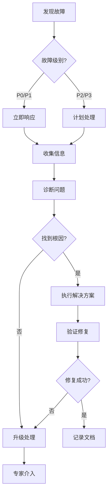

# {{serviceName}} 故障处理手册

**创建日期**: {{date}}  
**运维工程师**: {{sre}}  
**版本**: 1.0

## 概述

本文档提供 {{serviceName}} 微服务的故障处理手册（Runbook），用于快速定位和解决常见问题。

## 故障分类

### 故障级别

| 级别 | 描述 | 响应时间 | 处理时间 |
|------|------|---------|---------|
| P0 | 服务完全不可用 | {{responseTimeP0}} | {{resolutionTimeP0}} |
| P1 | 核心功能不可用 | {{responseTimeP1}} | {{resolutionTimeP1}} |
| P2 | 部分功能受影响 | {{responseTimeP2}} | {{resolutionTimeP2}} |
| P3 | 轻微影响 | {{responseTimeP3}} | {{resolutionTimeP3}} |

## 常见故障处理

### 故障1: 服务不可用

#### 症状

{{symptom1}}

#### 诊断步骤

1. {{diagnosticStep1}}
2. {{diagnosticStep2}}
3. {{diagnosticStep3}}

#### 解决方案

{{solution1}}

#### 预防措施

{{prevention1}}

### 故障2: 数据库连接失败

#### 症状

{{symptom2}}

#### 诊断步骤

1. {{diagnosticStep1}}
2. {{diagnosticStep2}}

#### 解决方案

{{solution2}}

### 故障3: 消息队列异常

#### 症状

{{symptom3}}

#### 诊断步骤

1. {{diagnosticStep1}}
2. {{diagnosticStep2}}

#### 解决方案

{{solution3}}

## 故障排查流程

### 排查流程图

## 监控和告警

### 关键指标

| 指标名称 | 阈值 | 告警级别 | 处理方式 |
|---------|------|---------|---------|
| {{metric1}} | {{threshold1}} | {{alertLevel1}} | {{handlingMethod1}} |
| {{metric2}} | {{threshold2}} | {{alertLevel2}} | {{handlingMethod2}} |

### 告警处理

{{alertHandling}}

## 应急联系

### 联系人

| 角色 | 姓名 | 联系方式 | 职责 |
|------|------|---------|------|
| {{role1}} | {{name1}} | {{contact1}} | {{responsibility1}} |
| {{role2}} | {{name2}} | {{contact2}} | {{responsibility2}} |

## 相关文档

- [[deployment.md]] - 部署架构
- [[observability.md]] - 可观测性文档
- [[sre.md]] - SRE指标文档

## 变更记录

| 日期 | 版本 | 变更内容 | 变更人 |
|------|------|----------|--------|
| {{date}} | 1.0 | 初始版本 | {{sre}} |

