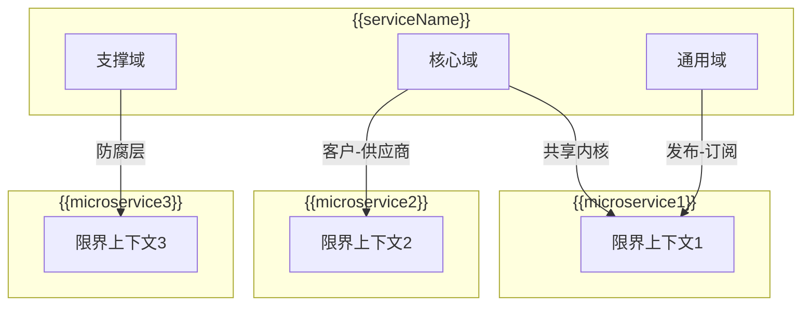

# {{serviceName}} 子领域映射

**创建日期**: {{date}}  
**领域专家**: {{domainExpert}}  
**版本**: 1.0

## 概述

本文档描述 {{serviceName}} 微服务的子领域映射和上下文映射（Context Mapping），包括与其他微服务的集成关系。

## 子领域映射

### 子领域分类

```mermaid
graph LR
    A[{{domainName}}] --> B[核心域]
    A --> C[支撑域]
    A --> D[通用域]
    B --> E[{{coreDomain1}}]
    B --> F[{{coreDomain2}}]
    C --> G[{{supportingDomain1}}]
    C --> H[{{supportingDomain2}}]
    D --> I[{{genericDomain1}}]
    D --> J[{{genericDomain2}}]
```

### 子领域详细映射

| 子领域名称 | 类型 | 描述 | 重要性 | 投资优先级 |
|-----------|------|------|--------|-----------|
| {{subdomain1}} | 核心域 | {{description1}} | {{importance1}} | {{priority1}} |
| {{subdomain2}} | 支撑域 | {{description2}} | {{importance2}} | {{priority2}} |
| {{subdomain3}} | 通用域 | {{description3}} | {{importance3}} | {{priority3}} |

## 上下文映射（Context Mapping）

### 上下文映射图



### 与其他微服务的集成关系

| 微服务名称 | 关系类型 | 描述 | 集成方式 |
|-----------|---------|------|---------|
| {{microservice1}} | {{relationshipType1}} | {{description1}} | {{integrationMethod1}} |
| {{microservice2}} | {{relationshipType2}} | {{description2}} | {{integrationMethod2}} |
| {{microservice3}} | {{relationshipType3}} | {{description3}} | {{integrationMethod3}} |

### 上下文映射关系类型

#### 共享内核（Shared Kernel）

| 微服务 | 共享内容 | 维护方式 |
|--------|---------|---------|
| {{microservice1}} | {{sharedContent1}} | {{maintenanceMethod1}} |

#### 客户-供应商（Customer-Supplier）

| 客户服务 | 供应商服务 | 契约方式 |
|---------|-----------|---------|
| {{customerService1}} | {{supplierService1}} | {{contractMethod1}} |

#### 防腐层（Anti-Corruption Layer）

| 上游服务 | 防腐层实现 | 描述 |
|---------|-----------|------|
| {{upstreamService1}} | {{aclImplementation1}} | {{description1}} |

#### 发布-订阅（Publish-Subscribe）

| 发布者 | 订阅者 | 事件类型 |
|--------|--------|---------|
| {{publisher1}} | {{subscriber1}} | {{eventType1}} |

## 领域间依赖关系

### 依赖关系图

```mermaid
graph TD
    A[核心域] --> B[支撑域]
    A --> C[通用域]
    B --> C
    A --> D[{{microservice1}}]
    B --> E[{{microservice2}}]
```

### 依赖清单

| 依赖方 | 被依赖方 | 依赖类型 | 描述 |
|--------|---------|---------|------|
| {{dependent1}} | {{dependency1}} | {{dependencyType1}} | {{description1}} |
| {{dependent2}} | {{dependency2}} | {{dependencyType2}} | {{description2}} |

## 集成策略

### 同步集成

{{synchronousIntegration}}

### 异步集成

{{asynchronousIntegration}}

### 数据一致性

{{dataConsistency}}

## 相关文档

- [[domain-overview.md]] - 领域概览
- [[bounded-context.md]] - 限界上下文
- [[../01-overview/context-diagram.md]] - 系统上下文图

## 变更记录

| 日期 | 版本 | 变更内容 | 变更人 |
|------|------|----------|--------|
| {{date}} | 1.0 | 初始版本 | {{domainExpert}} |

