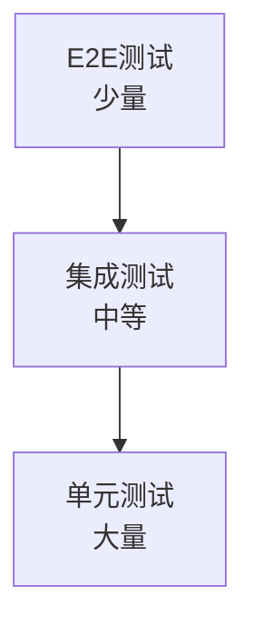
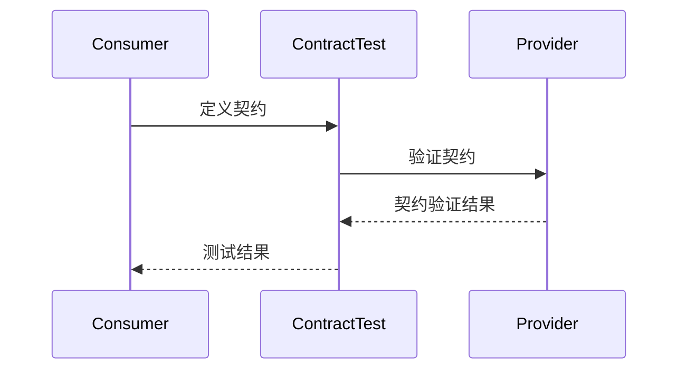

# {{serviceName}} 测试策略

**创建日期**: {{date}}  
**测试工程师**: {{tester}}  
**版本**: 1.0

## 概述

本文档定义 {{serviceName}} 微服务的测试策略，包括单元测试、集成测试和契约测试。

## 测试金字塔

### 测试层次

### 测试分布

| 测试类型 | 占比 | 描述 |
|---------|------|------|
| 单元测试 | {{unitTestPercentage}} | {{unitTestDescription}} |
| 集成测试 | {{integrationTestPercentage}} | {{integrationTestDescription}} |
| 契约测试 | {{contractTestPercentage}} | {{contractTestDescription}} |
| E2E测试 | {{e2eTestPercentage}} | {{e2eTestDescription}} |

## 单元测试

### 测试范围

{{unitTestScope}}

### 测试覆盖率目标

{{unitTestCoverageTarget}}

### 测试工具

{{unitTestTools}}

### 测试示例

{{unitTestExample}}

## 集成测试

### 测试范围

{{integrationTestScope}}

### 测试策略

{{integrationTestStrategy}}

### 测试工具

{{integrationTestTools}}

### 测试环境

{{integrationTestEnvironment}}

## 契约测试

### 测试范围

{{contractTestScope}}

### 契约定义

{{contractDefinition}}

### 测试工具

{{contractTestTools}}

### 契约测试流程

## 性能测试

### 测试类型

{{performanceTestTypes}}

### 性能指标

| 指标名称 | 目标值 | 测量方法 |
|---------|--------|---------|
| {{performanceMetric1}} | {{targetValue1}} | {{measurementMethod1}} |
| {{performanceMetric2}} | {{targetValue2}} | {{measurementMethod2}} |

### 测试工具

{{performanceTestTools}}

## 安全测试

### 测试范围

{{securityTestScope}}

### 测试类型

{{securityTestTypes}}

### 测试工具

{{securityTestTools}}

## 测试自动化

### CI/CD 集成

{{cicdIntegration}}

### 测试执行流程

{{testExecutionFlow}}

## 测试数据管理

{{testDataManagement}}

## 相关文档

- [[performance-test.md]] - 性能测试文档
- [[../07-security/threat-model.md]] - 威胁建模

## 变更记录

| 日期 | 版本 | 变更内容 | 变更人 |
|------|------|----------|--------|
| {{date}} | 1.0 | 初始版本 | {{tester}} |

