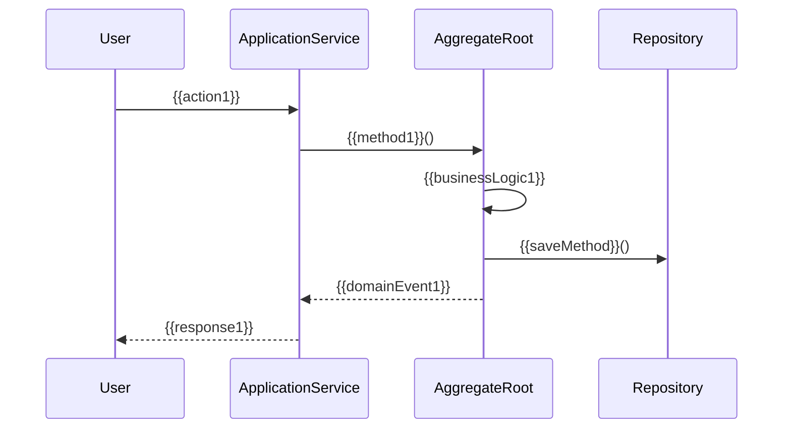

# {{subdomainName}} 业务用例

**创建日期**: {{date}}  
**领域专家**: {{domainExpert}}  
**版本**: 1.0

## 概述

本文档描述 {{subdomainName}} 子领域的主要业务用例。

## 用例列表

| 用例ID | 用例名称 | 优先级 | 描述 |
|--------|---------|--------|------|
| UC-001 | {{useCase1}} | {{priority1}} | {{description1}} |
| UC-002 | {{useCase2}} | {{priority2}} | {{description2}} |
| UC-003 | {{useCase3}} | {{priority3}} | {{description3}} |

## 用例详细说明

### UC-001: {{useCase1}}

#### 用例描述

{{useCaseDescription1}}

#### 参与者

{{actors1}}

#### 前置条件

{{preconditions1}}

#### 后置条件

{{postconditions1}}

#### 主流程

1. {{step1}}
2. {{step2}}
3. {{step3}}

#### 备选流程

**备选流程A**: {{alternativeFlowA}}

1. {{stepA1}}
2. {{stepA2}}

**备选流程B**: {{alternativeFlowB}}

1. {{stepB1}}
2. {{stepB2}}

#### 异常流程

**异常流程1**: {{exceptionFlow1}}

1. {{exceptionStep1}}
2. {{exceptionStep2}}

#### 业务规则

{{businessRules1}}

#### 涉及聚合

{{involvedAggregates1}}

#### 领域事件

{{domainEvents1}}

#### 用例图



### UC-002: {{useCase2}}

#### 用例描述

{{useCaseDescription2}}

#### 参与者

{{actors2}}

#### 前置条件

{{preconditions2}}

#### 后置条件

{{postconditions2}}

#### 主流程

1. {{step1}}
2. {{step2}}
3. {{step3}}

## 用例关系

### 用例关系图

```mermaid
graph TD
    A[{{useCase1}}] --> B[{{useCase2}}]
    A --> C[{{useCase3}}]
    B --> D[{{useCase4}}]
```

### 包含关系

| 主用例 | 包含用例 | 描述 |
|--------|---------|------|
| {{mainUseCase1}} | {{includedUseCase1}} | {{description1}} |

### 扩展关系

| 基础用例 | 扩展用例 | 扩展点 | 描述 |
|---------|---------|--------|------|
| {{baseUseCase1}} | {{extendingUseCase1}} | {{extensionPoint1}} | {{description1}} |

## 业务价值

{{businessValue}}

## 相关文档

- [[README.md]] - 子领域说明
- [[domain-model.md]] - 领域模型
- [[aggregates.md]] - 聚合根详细说明

## 变更记录

| 日期 | 版本 | 变更内容 | 变更人 |
|------|------|----------|--------|
| {{date}} | 1.0 | 初始版本 | {{domainExpert}} |

